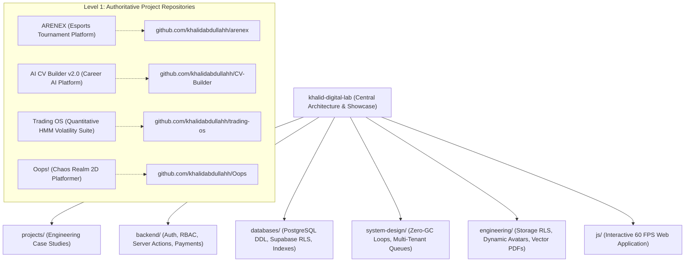

# AGENTS.md — Developer & AI Agent Guidebook

## 1. Project Identity & Philosophy

**Project Name:** Khalid Abdullah — Personal Digital Lab & Innovation Hub  
**Author:** Khalid Abdullah (Computer Science Researcher, Backend Engineer & Quantitative Finance Enthusiast)  
**Core Mission:** A living personal digital engineering laboratory, architecture showcase, and cross-project knowledge base combining:
$$\text{Learning} \longrightarrow \text{Researching} \longrightarrow \text{Experimenting} \longrightarrow \text{Building} \longrightarrow \text{Shipping}$$

> «Who I am + What I am researching + What I am building + What I have learned + What people can actually use.»

This project is **NOT a traditional resume portfolio** ("About → Skills → Projects → Contact"). It is an active innovation hub and living product workspace.

---

## 2. Master Two-Level GitHub Architecture



### Key Principles:
1. **Level 1 (Individual Repositories):** Every project keeps its own source code, database migrations, and deployment configs. Never remove backend, database, or API docs from project repos.
2. **Level 2 (Central Showcase - `khalid-digital-lab`):** Central engineering portfolio, technical lab, architecture showcase, and cross-project knowledge base linking to individual repositories.
3. **No Fake Duplication:** Never copy entire project source trees into `khalid-digital-lab`. Use architecture case studies, SQL DDL schemas, Mermaid diagrams, and code snippets.

---

## 3. Complete Directory Structure Guide

```
/Users/khalidabdullah/AntiGravity/Website/
├── index.html                                 # Master semantic HTML5 skeleton
├── README.md                                  # Developer & architecture overview
├── AGENTS.md                                  # This agent instruction guide
├── ROADMAP.md                                 # Phased development roadmap
├── CHANGELOG.md                               # Version release history
├── .gitignore                                 # Git exclusion rules
├── .env.example                               # Environment variable documentation
├── projects/                                  # Project Architecture Case Studies
│   ├── README.md                              # Master projects registry
│   ├── arenex/README.md                       # ARENEX full-stack esports platform
│   ├── cv-builder/README.md                   # AI CV Builder v2.0
│   ├── trading-os/README.md                   # Quantitative Market Regime Suite
│   ├── oops/README.md                         # Oops! 150-stage multiverse platformer
│   ├── findoc/README.md                       # FinDoc SEC NLP alpha extractor
│   ├── algoviz/README.md                      # AlgoViz algorithm visualizer
│   ├── aurex/README.md                        # AUREX game mechanics engine
│   └── devil-door/README.md                   # Devil's Door atmospheric action
├── backend/                                   # Backend Architecture Guides
│   ├── README.md                              # Backend standards overview
│   ├── authentication/
│   │   └── supabase-auth-case-study.md        # OAuth, Edge Middleware & JWT validation
│   ├── authorization/
│   │   └── rbac-super-admin-matrix.md         # RBAC matrix & privilege escalation defenses
│   ├── api-design/
│   │   └── server-actions-and-rpc.md          # Server Actions vs REST vs PostgreSQL RPC
│   └── server-architecture/
│       └── payment-verification-workflow.md   # Multi-step payment state machines
├── databases/                                 # Database & Relational Standards
│   ├── README.md                              # Database guide overview
│   ├── supabase/
│   │   └── arenex-schema-and-rls.md           # Full 9-table DDL & RLS policies
│   ├── schema-design/
│   │   └── financial-privacy-isolation.md     # Decoupled public/private accounting
│   └── indexing/
│       └── performance-and-query-optimization.md # Composite & partial indexing
├── system-design/                             # System Design & Scalability
│   ├── README.md                              # System design overview
│   ├── system-design-case-studies/
│   │   └── esports-tournament-platform.md     # Multi-tenant tournament architecture
│   ├── architecture-patterns/
│   │   └── zero-gc-state-machines.md          # Memory pool management (60 FPS)
│   └── scalability/
│       └── realtime-regime-simulation.md      # In-browser stochastic simulation
├── engineering/                               # Software Engineering Standards
│   ├── README.md                              # Engineering standards overview
│   ├── security/
│   │   └── storage-bucket-rls-and-dynamic-avatars.md # Storage RLS & avatar joins
│   ├── performance/
│   │   └── vector-pdf-and-client-compression.md # Pure vector PDF engines
│   └── clean-architecture/
│       └── data-driven-ui-layering.md         # Decoupled data-driven UI triad
├── css/
│   ├── main.css                               # Design tokens, typography, dark/light themes
│   ├── components.css                         # Card glows, buttons, modals, sliders
│   ├── lab.css                                # Lab dashboard & simulator layout
│   ├── graph.css                              # Knowledge Graph canvas styling
│   └── responsive.css                         # Mobile dock & touch ergonomics
├── js/
│   ├── config.js                              # Profile metadata, author info, live stats
│   ├── app.js                                 # Main application bootstrap & router
│   ├── data/
│   │   ├── experiments.js                     # The Lab research inquiries dataset
│   │   ├── projects.js                        # Featured & supporting projects registry
│   │   ├── tools.js                           # Tools & products registry
│   │   ├── knowledge.js                       # Knowledge base articles & formulas
│   │   ├── knowledgeGraph.js                  # Knowledge graph nodes & links
│   │   └── buildLog.js                        # Chronological build log milestones
│   └── components/
│       ├── Navigation.js                      # Dynamic header & mobile dock
│       ├── HeroCanvas.js                      # Algorithmic particle node canvas
│       ├── CurrentlyBuilding.js               # Live in-progress build ticker
│       ├── LabSection.js                      # Lab dashboard & detail modal
│       ├── ProjectsSection.js                 # Featured showcase & supporting grid
│       ├── ToolsSection.js                    # Tool hub & embedded workbench
│       ├── KnowledgeSection.js                # Knowledge space & Graph canvas
│       ├── BuildLogSection.js                 # Chronological timeline
│       ├── AboutSection.js                    # Profile, philosophy & contact
│       ├── LiveStats.js                       # Dynamic animated metric counters
│       ├── CommandPalette.js                  # Global Cmd+K fuzzy search
│       ├── TerminalModal.js                   # Developer CLI terminal emulator
│       ├── CustomCursor.js                    # Magnetic morphing cursor
│       └── InteractiveTools/
│           ├── RegimeSimulator.js             # Real-time HMM market regime simulator
│           ├── ATSAnalyzer.js                 # ATS resume keyword density scanner
│           ├── KellyCalculator.js             # Quantitative position sizing calculator
│           └── VectorNormVisualizer.js        # Geometric vector norm unit ball canvas
└── docs/
    ├── ARCHITECTURE.md                        # Deep technical system documentation
    └── CV_BUILDER_INTEGRATION.md              # Flagship AI CV Builder integration details
```

---

## 4. Development Rules for AI Agents

1. **Audit Before Modifying:** Inspect the entire repository and understand existing components before writing code.
2. **Preserve Working Systems:** NEVER destroy or rewrite working features (e.g. the AI CV Builder, simulators, or knowledge graph).
3. **Data-Driven Architecture:** All tools, experiments, articles, projects, and logs must be stored in `js/data/`. Do not hardcode UI content directly inside components.
4. **Zero-GC Canvas Loops:** When modifying canvas components (`HeroCanvas.js`, `RegimeSimulator.js`, `VectorNormVisualizer.js`, `KnowledgeSection.js`), reuse scratch vectors and avoid allocating objects inside `requestAnimationFrame`.
5. **No Secrets in Code:** NEVER commit API keys, tokens, or credentials. Use `.env.example` placeholders.
6. **Responsive & Mobile First:** Always maintain full responsiveness. Mobile devices use the ergonomic bottom dock (`#mobile-dock`).
7. **Accessibility & Reduced Motion:** Respect `prefers-reduced-motion` and maintain clear keyboard focus states.

---

## 5. Git Workflow & Conventions

### Branch Strategy:
- **`main`**: Production-ready code.
- **`feature/<name>`**: New tools, sections, or visual enhancements.
- **`fix/<name>`**: Bug fixes.
- **`experiment/<name>`**: New research experiments and data visualizations.

### Commit Messages:
Follow standard semantic commit conventions:
- `feat: document ARENEX full-stack esports architecture and RLS security matrix`
- `docs: update two-level portfolio architecture and backend guides`
- `refactor: optimize knowledge graph data nodes and relations`
- `chore: update system configuration and build log milestones`

---

## 6. Flagship Products & Core Implementations

- **ARENEX:** `https://github.com/khalidabdullahh` — Next.js 15+, Supabase, PostgreSQL RLS, Server Actions, Edge RBAC, Anti-Replay Payment State Machine.
- **AI CV Builder v2.0:** `https://github.com/khalidabdullahh/CV-Builder` — Live at `https://first-project-plum-phi.vercel.app` (10 ATS-optimized templates, Google Gemini AI prompt distillation, 100% vector PDF engine).
- **Trading OS / Market Regime Suite:** `https://github.com/khalidabdullahh` — 3-state Gaussian HMM, Parkinson/Garman-Klass volatility, in-browser Monte Carlo simulator, Kelly Criterion.
- **Oops! (Chaos Realm):** `https://github.com/khalidabdullahh/Oops` — Live at `https://oops-snowy-three.vercel.app/` (150 stages, zero-GC physics, synthesized Web Audio chiptunes).
