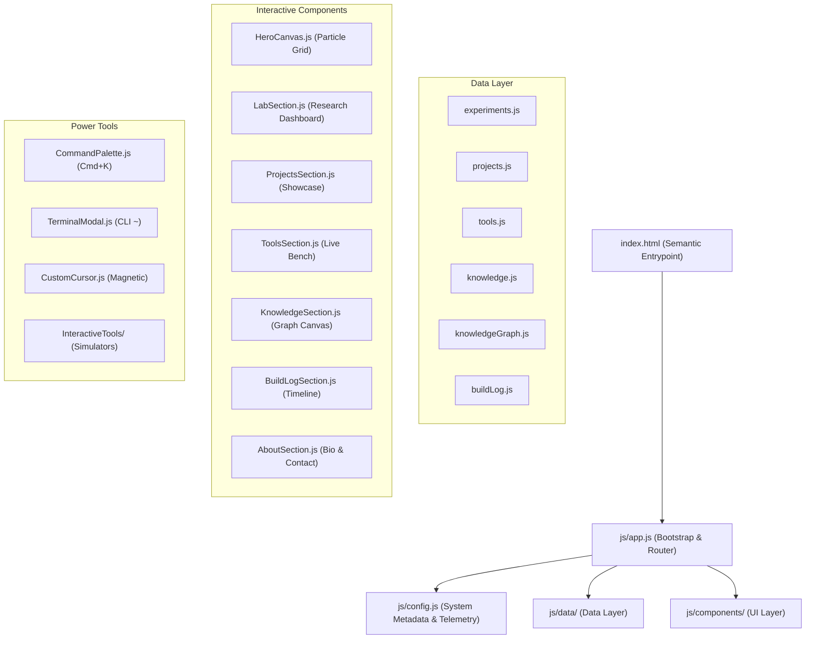

# AGENTS.md — Developer & AI Agent Guidebook

## 1. Project Identity & Philosophy

**Project Name:** Khalid Abdullah — Personal Digital Lab & Innovation Hub  
**Author:** Khalid Abdullah (Computer Science Undergraduate & Aspiring AI/ML Engineer / Quantitative Finance Enthusiast)  
**Core Mission:** A living personal digital laboratory combining:
$$\text{Learning} \longrightarrow \text{Researching} \longrightarrow \text{Experimenting} \longrightarrow \text{Building} \longrightarrow \text{Shipping}$$

> «Who I am + What I am researching + What I am building + What I have learned + What people can actually use.»

This project is **NOT a traditional resume portfolio** ("About → Skills → Projects → Contact"). It is an active innovation hub and living product workspace.

---

## 2. System Architecture

The project is built on a high-performance, modular, zero-dependency ES6+ Single Page Architecture.



### Key Technical Specifications:
- **Rendering & Animation:** Hardware-accelerated Canvas 2D with zero-allocation state loops to maintain 60 FPS.
- **Styling:** Modular CSS tokens (`css/main.css`, `css/components.css`, `css/lab.css`, `css/graph.css`, `css/responsive.css`) paired with Tailwind CSS utility classes.
- **Math Formulations:** LaTeX KaTeX notation for all mathematical and quantitative proofs.
- **Theme Engine:** Dark-first aesthetic (`#05070b`) with a persistent, accessible Light Theme toggle.

---

## 3. Directory Structure Guide

```
/Users/khalidabdullah/AntiGravity/Website/
├── index.html                                 # Master semantic HTML5 skeleton
├── README.md                                  # Developer overview
├── AGENTS.md                                  # This agent instruction guide
├── ROADMAP.md                                 # Phased development roadmap
├── CHANGELOG.md                               # Version release history
├── .gitignore                                 # Git exclusion rules
├── .env.example                               # Environment variable documentation
├── css/
│   ├── main.css                               # Design tokens, typography, dark/light themes
│   ├── components.css                         # Card glows, buttons, modals, sliders
│   ├── lab.css                                # Lab dashboard & simulator layout
│   ├── graph.css                              # Knowledge Graph canvas styling
│   └── responsive.css                         # Mobile dock & touch ergonomics
├── js/
│   ├── config.js                              # Profile metadata, author info, live stats
│   ├── app.js                                 # Main application bootstrap & router
│   ├── data/
│   │   ├── experiments.js                     # The Lab research inquiries dataset
│   │   ├── projects.js                        # Featured & supporting projects registry
│   │   ├── tools.js                           # Tools & products registry
│   │   ├── knowledge.js                       # Knowledge base articles & formulas
│   │   ├── knowledgeGraph.js                  # Knowledge graph nodes & links
│   │   └── buildLog.js                        # Chronological build log milestones
│   └── components/
│       ├── Navigation.js                      # Dynamic header & mobile dock
│       ├── HeroCanvas.js                      # Algorithmic particle node canvas
│       ├── CurrentlyBuilding.js               # Live in-progress build ticker
│       ├── LabSection.js                      # Lab dashboard & detail modal
│       ├── ProjectsSection.js                 # Featured showcase & supporting grid
│       ├── ToolsSection.js                    # Tool hub & embedded workbench
│       ├── KnowledgeSection.js                # Knowledge space & Graph canvas
│       ├── BuildLogSection.js                 # Chronological timeline
│       ├── AboutSection.js                    # Profile, philosophy & contact
│       ├── LiveStats.js                       # Dynamic animated metric counters
│       ├── CommandPalette.js                  # Global Cmd+K fuzzy search
│       ├── TerminalModal.js                   # Developer CLI terminal emulator
│       ├── CustomCursor.js                    # Magnetic morphing cursor
│       └── InteractiveTools/
│           ├── RegimeSimulator.js             # Real-time HMM market regime simulator
│           ├── ATSAnalyzer.js                 # ATS resume keyword density scanner
│           ├── KellyCalculator.js             # Quantitative position sizing calculator
│           └── VectorNormVisualizer.js        # Geometric vector norm unit ball canvas
└── docs/
    ├── ARCHITECTURE.md                        # Deep technical system documentation
    └── CV_BUILDER_INTEGRATION.md              # Flagship AI CV Builder integration details
```

---

## 4. Development Rules for AI Agents

1. **Audit Before Modifying:** Inspect the entire repository and understand existing components before writing code.
2. **Preserve Working Systems:** NEVER destroy or rewrite working features (e.g. the AI CV Builder, simulators, or knowledge graph).
3. **Data-Driven Architecture:** All tools, experiments, articles, projects, and logs must be stored in `js/data/`. Do not hardcode UI content directly inside components.
4. **Zero-GC Canvas Loops:** When modifying canvas components (`HeroCanvas.js`, `RegimeSimulator.js`, `VectorNormVisualizer.js`, `KnowledgeSection.js`), reuse scratch vectors and avoid allocating objects inside `requestAnimationFrame`.
5. **No Secrets in Code:** NEVER commit API keys, tokens, or credentials. Use `.env.example` placeholders.
6. **Responsive & Mobile First:** Always maintain full responsiveness. Mobile devices use the ergonomic bottom dock (`#mobile-dock`).
7. **Accessibility & Reduced Motion:** Respect `prefers-reduced-motion` and maintain clear keyboard focus states.

---

## 5. Git Workflow & Conventions

### Branch Strategy:
- **`main`**: Production-ready code.
- **`feature/<name>`**: New tools, sections, or visual enhancements (e.g. `feature/options-pricer`).
- **`fix/<name>`**: Bug fixes (e.g. `fix/mobile-touch-target`).
- **`experiment/<name>`**: New research experiments and data visualizations.

### Commit Messages:
Follow standard semantic commit conventions:
- `feat: add quantitative backtesting tool`
- `fix: correct mobile dock z-index overlap`
- `docs: update architecture documentation`
- `refactor: optimize knowledge graph spring physics`
- `chore: update configuration and dependencies`

---

## 6. Flagship Product: AI CV Builder Integration

- **Repository:** `https://github.com/khalidabdullahh/CV-Builder`
- **Live Production:** `https://first-project-plum-phi.vercel.app`
- **Key Features:** 10 ATS-optimized templates, Google Gemini AI bullet rephrasing, 1-click clean HD vector PDF generation.
- **Integration Point:** Featured in `js/data/tools.js` as the flagship product and `js/data/experiments.js` as Experiment E-03 (ATS Embedding & Prompt Distillation).

---

## 7. Current State & Known Issues

- **Build Status:** 100% Static & Portable. Can be hosted on Vercel, GitHub Pages, Cloudflare Pages, or locally via `python3 -m http.server 8080`.
- **Known Issues:** None. All 31 files verified and running cleanly.
