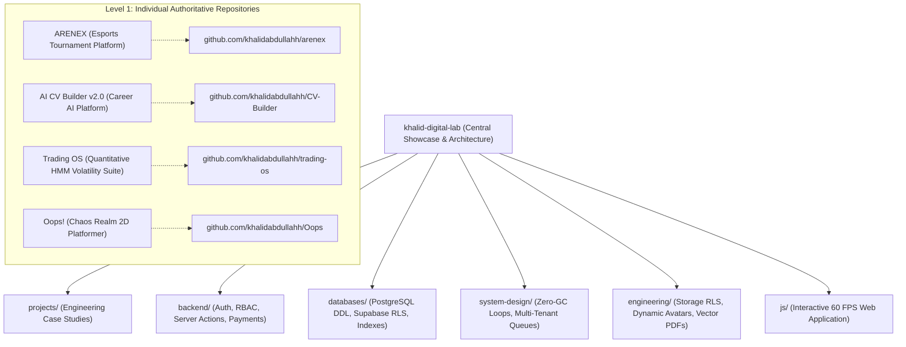

# 🧪 Khalid Abdullah — Personal Digital Lab & Engineering Innovation Hub

A modern, interactive, dark-first personal digital engineering laboratory, cross-project architecture showcase, and living product ecosystem representing:

$$\text{Learning} \longrightarrow \text{Researching} \longrightarrow \text{Experimenting} \longrightarrow \text{Building} \longrightarrow \text{Shipping}$$

[](https://first-project-plum-phi.vercel.app)
[](https://github.com/khalidabdullahh)

---

## 🏛️ Master Portfolio Architecture

This central repository (`khalid-digital-lab`) acts as my **Digital Engineering Portfolio, Technical Lab, Architecture Showcase, and Cross-Project Knowledge Base**.



---

## ⚡ Engineered Projects & Technical Case Studies

| Project | Category | Architectural Highlights | Case Study | Authoritative Repository |
| :--- | :--- | :--- | :--- | :--- |
| **ARENEX** | Esports Tournament Platform & Web App | Next.js 15+, Supabase, PostgreSQL RLS, Edge RBAC, Anti-Replay Payments, Time-Gated Room Credentials, Dynamic Leaderboard Avatars | [Case Study](./projects/arenex/) | [ARENEX Repo ↗](https://github.com/khalidabdullahh) |
| **AI CV Builder v2.0** | Career AI & Vector PDF Platform | Next.js 16, React 19, Google Gemini 1.5 Flash Two-Pass Prompt Distillation, 10 Layout Models, 100% Vector Searchable PDF Engine | [Case Study](./projects/cv-builder/) | [CV-Builder Repo ↗](https://github.com/khalidabdullahh/CV-Builder) |
| **Trading OS** | Quantitative Finance & ML | 3-State Gaussian HMM, Parkinson & Garman-Klass Volatility, In-Browser Monte Carlo Playground, Kelly Criterion Risk Engine | [Case Study](./projects/trading-os/) | [Trading OS Repo ↗](https://github.com/khalidabdullahh) |
| **Oops! (Chaos Realm)** | Game Systems & Physics Engine | Phaser 2D, Zero-Allocation Physics Loops (60 FPS), Procedural Web Audio Synthesis (0 KB Audio Files), 150 Handcrafted Stages | [Case Study](./projects/oops/) | [Oops Repo ↗](https://github.com/khalidabdullahh/Oops) |
| **FinDoc** | NLP & Financial Alpha Extraction | SEC 10-K/10-Q MD&A Parser, Parent-Document Vector Retrieval, Chain-of-Verification Reasoning, PEAD Sentiment Scoring | [Case Study](./projects/findoc/) | [FinDoc Repo ↗](https://github.com/khalidabdullahh) |
| **AlgoViz** | Algorithms & CS Education | Canvas 2D Step-Through Arena, Dijkstra/A* Pathfinding, Sorting Pointer Visualizer, 2D Memoization Grid | [Case Study](./projects/algoviz/) | [AlgoViz Repo ↗](https://github.com/khalidabdullahh) |
| **AUREX** | Real-Time Game Mechanics Engine | Frame-Locked Input Buffering, Decoupled Combat/Movement State Machines, Spatial Hitbox/Hurtbox Indexing | [Case Study](./projects/aurex/) | [AUREX Repo ↗](https://github.com/khalidabdullahh) |
| **Devil's Door** | Atmospheric Horror Framework | Psychological Sanity Accumulator FSM, Dynamic Vignette Shaders, Adaptive Sensory AI Perception | [Case Study](./projects/devil-door/) | [Devil's Door Repo ↗](https://github.com/khalidabdullahh) |

---

## 📚 Cross-Project Engineering Knowledge Base

### 1. ⚙️ [Backend Engineering](./backend/)
- **[Supabase OAuth & Session Lifecycles](./backend/authentication/supabase-auth-case-study.md):** Edge Middleware route guards, synchronous PostgreSQL profile triggers, and JWT validation.
- **[Role-Based Access Control (RBAC) Matrix](./backend/authorization/rbac-super-admin-matrix.md):** `USER`, `SUPER_ADMIN`, and `OWNER` security hierarchy with database-enforced privilege immutability.
- **[Server Actions vs REST vs RPC](./backend/api-design/server-actions-and-rpc.md):** Idempotent mutation patterns, Zod validation, and atomic database stored procedures.
- **[Multi-Step Payment State Machine](./backend/server-architecture/payment-verification-workflow.md):** Manual transaction ID reconciliation, anti-replay constraints, and time-gated lobby access.

### 2. 🗄️ [Databases & PostgreSQL](./databases/)
- **[Complete Production PostgreSQL Schema & RLS](./databases/supabase/arenex-schema-and-rls.md):** DDL for 9 core tables with exhaustive Row Level Security policies.
- **[Financial Privacy Isolation](./databases/schema-design/financial-privacy-isolation.md):** Decoupled accounting isolating public tournament parameters from internal business ledgers.
- **[PostgreSQL Indexing & Optimization](./databases/indexing/performance-and-query-optimization.md):** B-Tree, composite, and partial indexes for high-concurrency tournament queues.

### 3. 📐 [System Design & Scalability](./system-design/)
- **[Multi-Tenant Esports Platform System Design](./system-design/system-design-case-studies/esports-tournament-platform.md):** High-concurrency architecture blueprint handling thousands of players.
- **[Zero-Garbage-Collection State Loops](./system-design/architecture-patterns/zero-gc-state-machines.md):** Memory pool management and scratch vectors to prevent GC stutters in 60 FPS animation loops.
- **[In-Browser Real-Time Stochastic Simulation](./system-design/scalability/realtime-regime-simulation.md):** Running Monte Carlo and Viterbi decoding in client browser threads with `Float64Array`.

### 4. 🛠️ [Engineering Standards & Security](./engineering/)
- **[Storage Bucket RLS & Dynamic Avatars](./engineering/security/storage-bucket-rls-and-dynamic-avatars.md):** Authenticated storage path scoping and relational leaderboard joins.
- **[Pure Vector PDF Generation](./engineering/performance/vector-pdf-and-client-compression.md):** Direct PDF stream compilation vs DOM canvas rasterization.
- **[Data-Driven UI Layering](./engineering/clean-architecture/data-driven-ui-layering.md):** Decoupled data stores, reactive UI views, and canvas physics engines.

---

## 🛠️ In-Browser Live Interactive Simulators

- **AI CV Builder v2.0:** 10 ATS-optimized templates with Gemini AI bullet assistance ([Live Demo](https://first-project-plum-phi.vercel.app)).
- **Market Regime & Volatility Simulator:** Real-time Monte Carlo price path generation and 3-state HMM classification directly in the browser.
- **ATS Keyword & Density Scanner:** Lexical overlap, TF-IDF keyword extraction, and missing skill analysis.
- **Quantitative Kelly Criterion Calculator:** Optimal capital allocation $f^* = \frac{p(b+1)-1}{b}$ and 50% drawdown risk curves.
- **Geometric Vector Norm ($L_p$) Visualizer:** Interactive 2D unit ball transformation canvas ($L_1, L_2, L_\infty$).

---

## 🚀 Quick Setup & Local Execution

Run locally with zero build dependencies using Python 3:

```bash
cd /Users/khalidabdullah/AntiGravity/Website
python3 -m http.server 8080
```

Then navigate to: `http://localhost:8080` in your web browser.

---

## 👤 Author
**Khalid Abdullah**
- **GitHub:** [github.com/khalidabdullahh](https://github.com/khalidabdullahh)
- **LinkedIn:** [linkedin.com/in/khalid-abdullah-847724339](https://linkedin.com/in/khalid-abdullah-847724339)
- **Email:** seamafridi123456789@gmail.com
