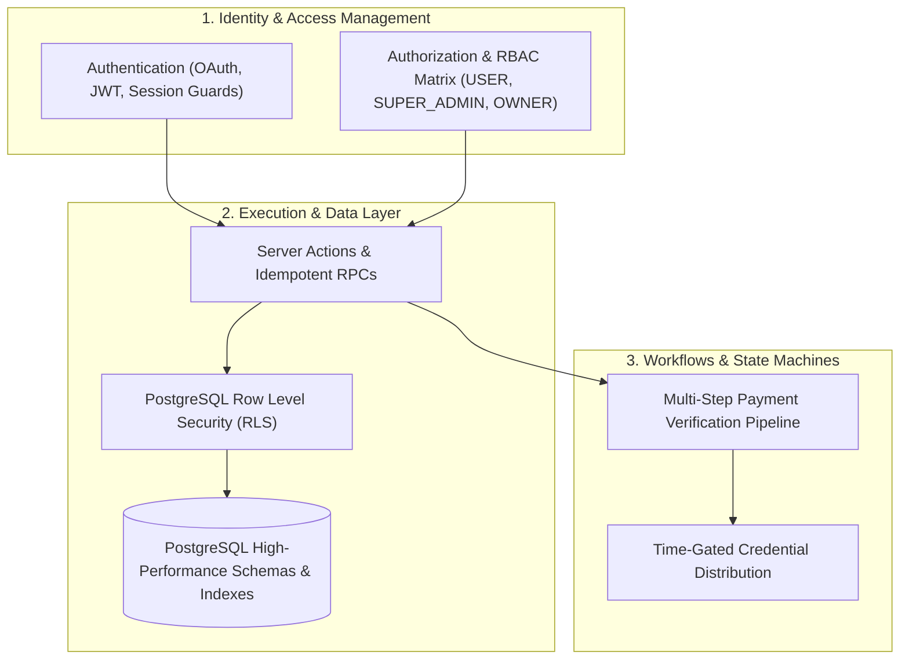

# ⚙️ Backend Engineering & System Architecture Knowledge Base

This section contains technical case studies, architectural patterns, security standards, and system designs implemented across production and experimental backend services by **Khalid Abdullah**.

---

## 🏛️ Key Backend Architectural Pillars

---

## 📚 Technical Articles & Deep Dives

1. **Authentication:**
   - [`backend/authentication/supabase-auth-case-study.md`](./authentication/supabase-auth-case-study.md): OAuth token exchange, JWT session validation, middleware route protection, and automatic profile trigger provisioning.
2. **Authorization & RBAC:**
   - [`backend/authorization/rbac-super-admin-matrix.md`](./authorization/rbac-super-admin-matrix.md): Strict role hierarchies, privilege escalation mitigation, and database-level policy verification.
3. **API & Server Architecture:**
   - [`backend/api-design/server-actions-and-rpc.md`](./api-design/server-actions-and-rpc.md): Next.js Server Actions vs REST endpoints, schema validation via Zod, and PostgreSQL stored procedures.
   - [`backend/server-architecture/payment-verification-workflow.md`](./server-architecture/payment-verification-workflow.md): Multi-step payment reconciliation state machines, preventing replay attacks, and secure transaction workflows.
