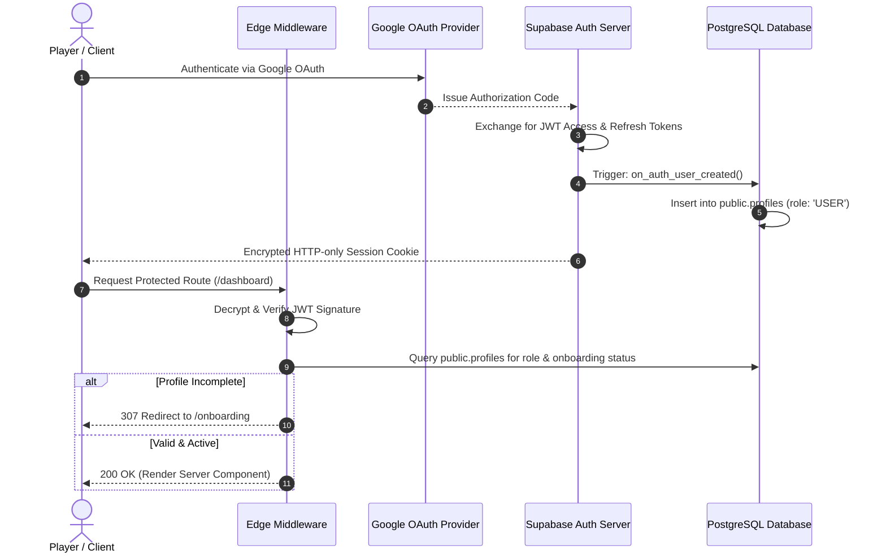

# 🔑 Supabase & OAuth Authentication Case Study

**Topic:** Session Lifecycle, JWT Claims, Middleware Route Guards & User Onboarding  
**Reference Implementations:** ARENEX, AI CV Builder  
**Author:** Khalid Abdullah  

---

## 📌 Architectural Overview

Modern production web applications require an authentication layer that is **stateless at the edge**, **cryptographically verifiable**, and seamlessly coupled to relational user profiles without race conditions.



---

## 🛠️ 1. Edge Middleware Route Guard Pattern

In Next.js App Router, session verification is executed at the edge using `@supabase/ssr`:

```typescript
// middleware.ts
import { createServerClient } from "@supabase/ssr";
import { NextResponse, type NextRequest } from "next/server";

export async function middleware(request: NextRequest) {
  let response = NextResponse.next({ request: { headers: request.headers } });

  const supabase = createServerClient(
    process.env.NEXT_PUBLIC_SUPABASE_URL!,
    process.env.NEXT_PUBLIC_SUPABASE_ANON_KEY!,
    {
      cookies: {
        getAll: () => request.cookies.getAll(),
        setAll: (cookiesToSet) => {
          cookiesToSet.forEach(({ name, value, options }) =>
            response.cookies.set(name, value, options)
          );
        },
      },
    }
  );

  const { data: { user } } = await supabase.auth.getUser();

  const isAuthRoute = request.nextUrl.pathname.startsWith("/login");
  const isProtectedRoute = request.nextUrl.pathname.startsWith("/dashboard") ||
                           request.nextUrl.pathname.startsWith("/profile");
  const isAdminRoute = request.nextUrl.pathname.startsWith("/admin");

  // 1. Unauthenticated users accessing protected routes -> Redirect to Login
  if (!user && (isProtectedRoute || isAdminRoute)) {
    const redirectUrl = new URL("/login", request.url);
    redirectUrl.searchParams.set("redirectTo", request.nextUrl.pathname);
    return NextResponse.redirect(redirectUrl);
  }

  // 2. Authenticated users attempting to view Login -> Redirect to Dashboard
  if (user && isAuthRoute) {
    return NextResponse.redirect(new URL("/dashboard", request.url));
  }

  // 3. Admin Authorization Check
  if (user && isAdminRoute) {
    const { data: profile } = await supabase
      .from("profiles")
      .select("role")
      .eq("id", user.id)
      .single();

    if (!profile || !["SUPER_ADMIN", "OWNER"].includes(profile.role)) {
      return NextResponse.redirect(new URL("/dashboard?error=unauthorized", request.url));
    }
  }

  return response;
}
```

---

## ⚡ 2. Zero-Race Condition Profile Creation Trigger

Instead of creating the user profile record via client-side code after login (which fails if the user closes the browser or network drops), the profile is created synchronously inside PostgreSQL via an ACID database trigger:

```sql
-- PostgreSQL Synchronous Profile Provisioning Trigger
CREATE OR REPLACE FUNCTION public.handle_new_user()
RETURNS trigger AS $$
BEGIN
  INSERT INTO public.profiles (id, username, full_name, avatar_url, role)
  VALUES (
    NEW.id,
    COALESCE(NEW.raw_user_meta_data->>'user_name', SPLIT_PART(NEW.email, '@', 1)),
    COALESCE(NEW.raw_user_meta_data->>'full_name', NEW.raw_user_meta_data->>'name', ''),
    COALESCE(NEW.raw_user_meta_data->>'avatar_url', NEW.raw_user_meta_data->>'picture', ''),
    'USER'
  )
  ON CONFLICT (id) DO NOTHING;
  RETURN NEW;
END;
$$ LANGUAGE plpgsql SECURITY DEFINER;

CREATE TRIGGER on_auth_user_created
  AFTER INSERT ON auth.users
  FOR EACH ROW EXECUTE PROCEDURE public.handle_new_user();
```

---

## 🛡️ 3. Security Lessons Learned

1. **Never trust client-stored role claims:** Always query the database or use custom access token JWT claims signed by Supabase to verify `SUPER_ADMIN` status.
2. **Handle OAuth Redirect Loops:** Store state in cryptographic HTTP-only cookies rather than URL query parameters to avoid replay tampering.
