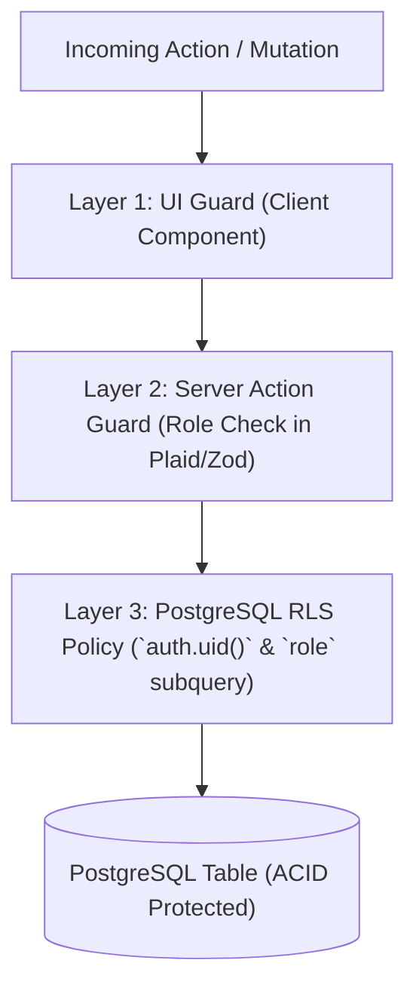
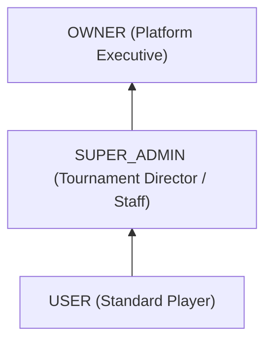

# 🛡️ Role-Based Access Control (RBAC) & Super Admin Security Matrix

**Topic:** Authorization Hierarchy, Privilege Escalation Prevention & Database Layer Enforcement  
**Reference Implementations:** ARENEX  
**Author:** Khalid Abdullah  

---

## 📌 Access Control Philosophy

In secure production systems, authorization must follow **Defense-in-Depth**:
1. **UI Layer:** Conditionally renders navigation items and admin buttons (UX convenience only).
2. **Server Action / API Layer:** Asserts session identity and role permissions before executing mutations.
3. **Database RLS Layer:** Enforces cryptographic Row Level Security directly on SQL statements, ensuring that even a compromised server action cannot leak unauthorized records.



---

## 🏛️ 1. Hierarchical Role Taxonomy



| Role | Operational Scope | Typical Actions |
| :--- | :--- | :--- |
| **USER** | Personal Data Scope | Register for matches, submit own payment receipts, view confirmed room IDs. |
| **SUPER_ADMIN** | Tournament & Operations Scope | Create/edit tournaments, verify payment transactions, input match scores. |
| **OWNER** | System & Financial Scope | View platform revenue and profit margins, assign/revoke admin roles, audit platform logs. |

---

## 🔒 2. Preventing Privilege Escalation Attacks

### The Vulnerability:
A malicious user sends a forged `PATCH /api/profiles` payload containing `{ "role": "SUPER_ADMIN" }`.

### The Architectural Mitigation:
1. **Immutable Role Column via RLS:**
```sql
-- Normal users cannot update their own 'role' column
CREATE POLICY "Users can only update safe profile fields" 
ON public.profiles 
FOR UPDATE 
USING (auth.uid() = id)
WITH CHECK (
  auth.uid() = id AND 
  role = (SELECT role FROM public.profiles WHERE id = auth.uid())
);
```

2. **Admin Role Assignment via Security Definer Function:**
Only users with existing `role = 'OWNER'` can execute role promotions:

```sql
CREATE OR REPLACE FUNCTION public.set_user_role(target_user_id UUID, new_role VARCHAR)
RETURNS void AS $$
BEGIN
  IF NOT EXISTS (
    SELECT 1 FROM public.profiles WHERE id = auth.uid() AND role = 'OWNER'
  ) THEN
    RAISE EXCEPTION 'Access Denied: Only platform Owners can promote users.';
  END IF;

  UPDATE public.profiles
  SET role = new_role, updated_at = NOW()
  WHERE id = target_user_id;
END;
$$ LANGUAGE plpgsql SECURITY DEFINER;
```
