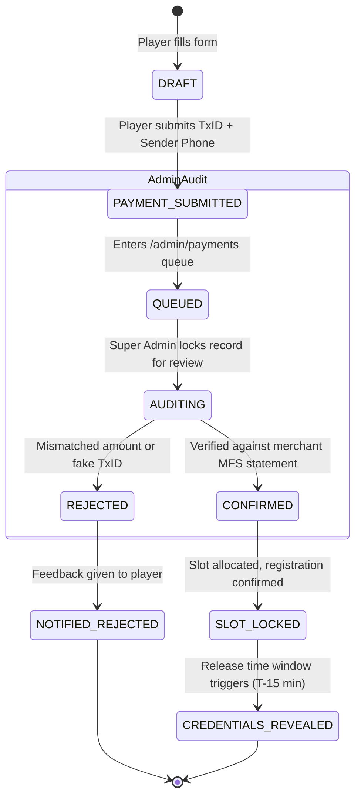

# 💳 Multi-Step Payment Verification & State Reconciliation Architecture

**Topic:** Manual Transaction Verification, Preventing Double-Spending, and Room Credential Gating  
**Reference Implementations:** ARENEX  
**Author:** Khalid Abdullah  

---

## 📌 The Business & Technical Problem

In emerging esports markets and indie gaming platforms, players frequently register using local Mobile Financial Services (bKash, Nagad, Rocket, UPI) or manual bank transfers rather than automated credit card gateways. 

This introduces critical security challenges:
1. **Replay Attacks / Fake Transaction IDs:** Malicious players submitting random numbers or reusing the same transaction ID across multiple matches.
2. **Race Conditions in Slot Capacity:** Two players paying simultaneously when only one slot remains.
3. **Premature Room Leakage:** Unauthorized players discovering match room credentials before payment is settled.

---

## 🔄 1. The Verification State Machine



---

## 🛡️ 2. Database Protections Against Fraud

### 2.1 Replay Attack Prevention via Unique Constraints
```sql
-- Prevents reusing the same transaction ID within the same payment method
ALTER TABLE public.payment_records
ADD CONSTRAINT unique_payment_tx_per_method 
UNIQUE (payment_method, transaction_id);
```

### 2.2 Atomic Slot Allocation RPC
```sql
CREATE OR REPLACE FUNCTION public.confirm_payment_and_allocate_slot(
  p_payment_id UUID,
  p_admin_id UUID
)
RETURNS boolean AS $$
DECLARE
  v_reg_id UUID;
  v_tourn_id UUID;
  v_current_count INT;
  v_max_count INT;
BEGIN
  -- 1. Check Super Admin Privileges
  IF NOT EXISTS (
    SELECT 1 FROM public.profiles WHERE id = p_admin_id AND role IN ('SUPER_ADMIN', 'OWNER')
  ) THEN
    RAISE EXCEPTION 'Unauthorized: Only Super Admins can confirm payments';
  END IF;

  -- 2. Lock Registration and Tournament Row (FOR UPDATE prevents race conditions)
  SELECT registration_id INTO v_reg_id FROM public.payment_records WHERE id = p_payment_id;
  SELECT tournament_id INTO v_tourn_id FROM public.tournament_registrations WHERE id = v_reg_id;
  
  SELECT COUNT(*) INTO v_current_count 
  FROM public.tournament_registrations 
  WHERE tournament_id = v_tourn_id AND status = 'CONFIRMED';

  SELECT max_participants INTO v_max_count 
  FROM public.tournaments 
  WHERE id = v_tourn_id FOR UPDATE;

  IF v_current_count >= v_max_count THEN
    RAISE EXCEPTION 'Tournament capacity reached (%/% slots full)', v_current_count, v_max_count;
  END IF;

  -- 3. Update Payment and Registration Status Atomically
  UPDATE public.payment_records 
  SET status = 'VERIFIED', verified_by = p_admin_id, verified_at = NOW() 
  WHERE id = p_payment_id;

  UPDATE public.tournament_registrations 
  SET status = 'CONFIRMED', slot_number = v_current_count + 1 
  WHERE id = v_reg_id;

  RETURN TRUE;
END;
$$ LANGUAGE plpgsql SECURITY DEFINER;
```
