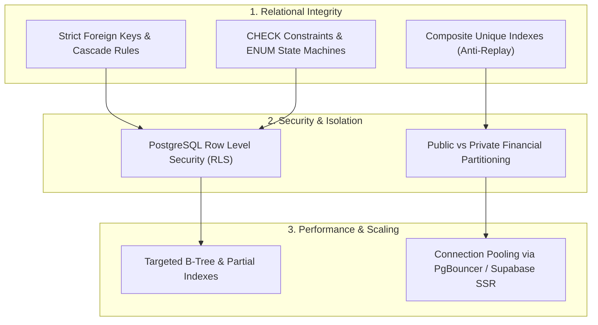

# 🗄️ Database Engineering, PostgreSQL & Supabase Standards

This section contains schema designs, Row Level Security (RLS) policies, query optimization benchmarks, and relational modeling standards implemented by **Khalid Abdullah**.

---

## 🏛️ Database Architectural Principles

---

## 📚 Technical Reference Guides

1. **Full Production Schema & RLS:**
   - [`databases/supabase/arenex-schema-and-rls.md`](./supabase/arenex-schema-and-rls.md): Complete DDL specifications for `profiles`, `games`, `game_accounts`, `tournaments`, `tournament_registrations`, `payout_profiles`, `payment_records`, `room_credentials`, and `leaderboard_entries` with exhaustive RLS policies.
2. **Financial Privacy & Isolation:**
   - [`databases/schema-design/financial-privacy-isolation.md`](./schema-design/financial-privacy-isolation.md): Isolating public player-facing data (entry fees, prize distributions) from private business accounting (platform margins, transaction fees).
3. **Indexing & Optimization:**
   - [`databases/indexing/performance-and-query-optimization.md`](./indexing/performance-and-query-optimization.md): Composite and partial indexes for high-concurrency tournament queries and live leaderboards.
