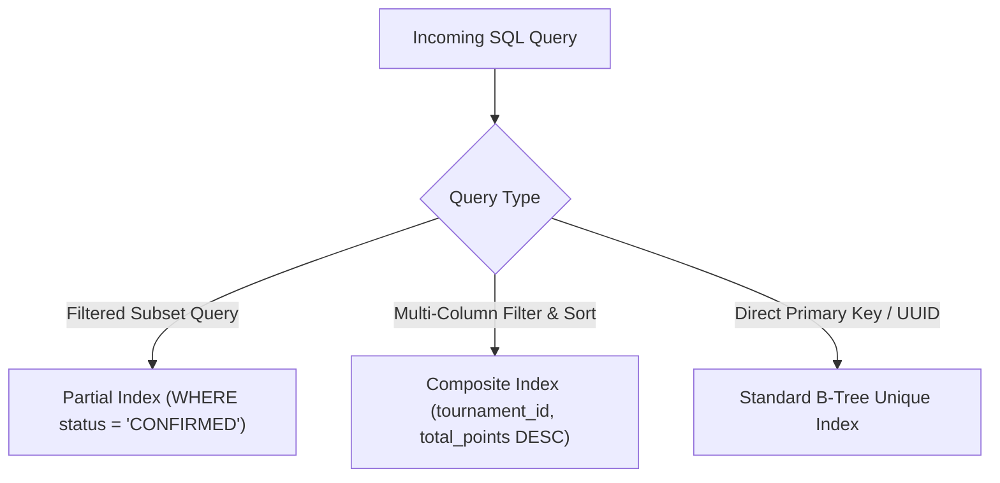

# ⚡ PostgreSQL Indexing & High-Concurrency Optimization

**Topic:** B-Tree, Composite, and Partial Indexes for Real-Time Match & Leaderboard Queries  
**Reference Implementations:** ARENEX, Trading OS  
**Author:** Khalid Abdullah  

---

## 📌 Indexing Strategy Matrix



---

## 🛠️ 1. High-Performance Index Definitions

### 1.1 Partial Index for Active Registrations
Standard tournament views only query confirmed players. Indexing pending or rejected records creates unneeded write overhead.

```sql
-- Partial Index: Only indexes confirmed registrations for blazing fast roster queries
CREATE INDEX idx_registrations_confirmed 
ON public.tournament_registrations (tournament_id, slot_number) 
WHERE status = 'CONFIRMED';
```

### 1.2 Composite Index for Real-Time Leaderboard Standings
Leaderboards sort by total points descending within a specific tournament:

```sql
-- Composite Index: Eliminates sorting step during leaderboard queries
CREATE INDEX idx_leaderboard_rankings 
ON public.leaderboard_entries (tournament_id, total_points DESC, placement_points DESC);
```

### 1.3 Anti-Replay Payment Index
```sql
-- Composite Unique Index: Instant duplicate payment detection
CREATE UNIQUE INDEX idx_unique_payment_method_tx 
ON public.payment_records (payment_method, transaction_id);
```
