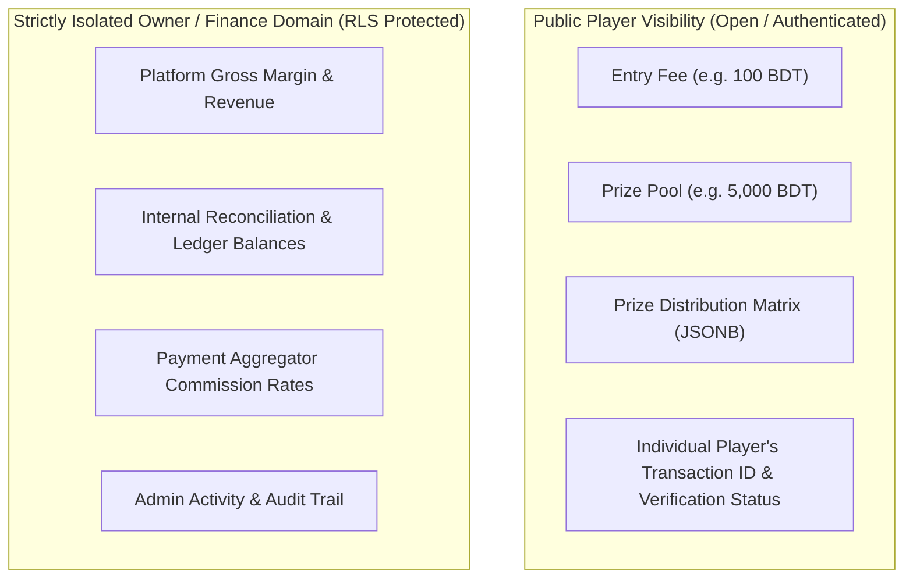

# 🔒 Financial Privacy Isolation in Competitive Platforms

**Topic:** Partitioning Player-Facing Metrics from Internal Platform Accounting  
**Reference Implementations:** ARENEX  
**Author:** Khalid Abdullah  

---

## 📌 Architecture of Financial Isolation

A critical system vulnerability in poorly architected tournament and SaaS platforms is leaking internal gross revenue, profit margins, payment gateway commission cuts, or private organizer bank balances through broad API queries.



---

## 🛡️ 1. Implementation Pattern: Decoupled Accounting Tables

Instead of storing internal platform margin fields directly on the public `tournaments` table, sensitive operational financials are isolated into a dedicated `platform_financial_ledger` table with restricted RLS:

```sql
CREATE TABLE public.platform_financial_ledger (
    id UUID PRIMARY KEY DEFAULT uuid_generate_v4(),
    tournament_id UUID REFERENCES public.tournaments(id) ON DELETE CASCADE,
    gross_collected NUMERIC(12,2) NOT NULL,
    total_payouts_distributed NUMERIC(12,2) NOT NULL,
    gateway_fees_incurred NUMERIC(10,2) DEFAULT 0.00 NOT NULL,
    net_platform_profit NUMERIC(12,2) GENERATED ALWAYS AS (
        gross_collected - total_payouts_distributed - gateway_fees_incurred
    ) STORED,
    created_at TIMESTAMPTZ DEFAULT NOW() NOT NULL
);

ALTER TABLE public.platform_financial_ledger ENABLE ROW LEVEL SECURITY;

-- Only platform OWNER role can view the internal ledger
CREATE POLICY "Only Owners access financial ledger" 
ON public.platform_financial_ledger FOR ALL 
USING (EXISTS (
    SELECT 1 FROM public.profiles WHERE id = auth.uid() AND role = 'OWNER'
));
```
