# System Architecture Document

## 1. Architectural Overview

The **Khalid Abdullah Personal Digital Lab** is designed around a modular, zero-dependency ES6+ Single Page Architecture. The core goal is to deliver an ultra-fast (&lt;50ms render, 60 FPS animation), accessible, and data-driven experience that represents an active research and development laboratory.

```mermaid
graph TD
    subgraph "Client Runtime Layer"
        HTML["index.html"]
        APP["js/app.js (Main Controller)"]
        CONF["js/config.js (Telemetry & Author Bio)"]
    end

    subgraph "UI Component Layer"
        NAV["Navigation.js (Desktop Header & Mobile Dock)"]
        HERO["HeroCanvas.js (Particle / Vector Field)"]
        RADAR["CurrentlyBuilding.js (Live Stream)"]
        LAB["LabSection.js (Research Inquiries & Modals)"]
        PROJ["ProjectsSection.js (Featured Showcase)"]
        TOOLS["ToolsSection.js (Interactive Workbench)"]
        KNOW["KnowledgeSection.js (Graph Canvas & Essays)"]
        BLOG["BuildLogSection.js (Chronological Timeline)"]
        ABOUT["AboutSection.js (Profile & Transmission)"]
    end

    subgraph "In-Browser Simulation Engines"
        SIM1["RegimeSimulator.js (HMM Monte Carlo)"]
        SIM2["ATSAnalyzer.js (Keyword Density Matcher)"]
        SIM3["KellyCalculator.js (Position Sizing & Risk)"]
        SIM4["VectorNormVisualizer.js (Lp Geometric Unit Ball)"]
    end

    subgraph "Power Layer"
        CMD["CommandPalette.js (Cmd+K Fuzzy Search)"]
        CLI["TerminalModal.js (Interactive CLI ~)"]
        CUR["CustomCursor.js (Magnetic Morphing)"]
    end

    HTML --> APP
    APP --> CONF
    APP --> NAV
    APP --> HERO
    APP --> RADAR
    APP --> LAB
    APP --> PROJ
    APP --> TOOLS
    APP --> KNOW
    APP --> BLOG
    APP --> ABOUT
    APP --> CMD
    APP --> CLI
    APP --> CUR

    TOOLS --> SIM1
    TOOLS --> SIM2
    TOOLS --> SIM3
    TOOLS --> SIM4
```

---

## 2. Component Layer & Data Flow

### 2.1 Decoupled Data Stores
All content and metadata are strictly separated from UI components inside `js/data/`:
- `experiments.js`: Research questions, hypotheses, methodologies, code snippets, and results.
- `projects.js`: Project metadata, problem/solution statements, architecture specs, and demo URLs.
- `tools.js`: Tool definitions, category tags, capabilities, and interactive bindings.
- `knowledge.js`: Markdown articles, reading times, and LaTeX formulas.
- `knowledgeGraph.js`: Topological nodes, cluster groups, and link strengths.
- `buildLog.js`: Chronological activity timeline milestones.

### 2.2 Event-Driven Interactivity
Components communicate via lightweight native DOM custom events:
- `open-command-palette`: Triggered via `⌘K` or search buttons.
- `open-terminal`: Triggered via `~` or header CLI button.
- `theme-change`: Coordinates dark and light theme transitions.

---

## 3. High-Performance Canvas & Animation Pipeline

All canvas animations (`HeroCanvas.js`, `RegimeSimulator.js`, `VectorNormVisualizer.js`, `KnowledgeSection.js`) adhere to a **Zero-Garbage-Collection (Zero-GC)** architecture:
1. **Pre-allocated Scratch Objects:** Coordinate objects and math vectors are pre-allocated during initialization rather than created inside `requestAnimationFrame`.
2. **Device Pixel Ratio Scaling:** Canvases detect `window.devicePixelRatio` and scale coordinate grids dynamically to ensure razor-sharp rendering on Retina / HiDPI screens.
3. **Reduced Motion Safeguards:** If `window.matchMedia("(prefers-reduced-motion: reduce)").matches` is detected, animations automatically fall back to static rendering.

---

## 4. Security & Deployment

- **Static Portability:** Zero Node.js build dependencies are required at runtime. The site can be served via any modern static web server or CDN (Vercel, GitHub Pages, Cloudflare Pages, Netlify, Nginx, or Python HTTP).
- **Zero Secrets Policy:** No sensitive keys or tokens are stored in the client-side bundle. All external API integrations (e.g. Gemini AI in the CV Builder) run through isolated serverless route handlers.
