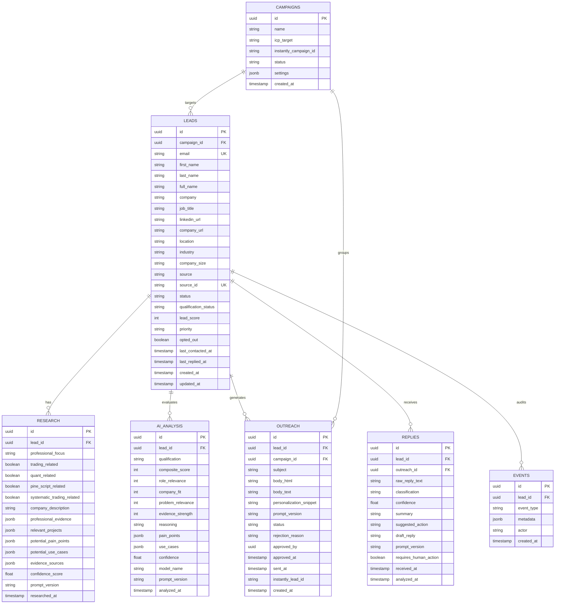
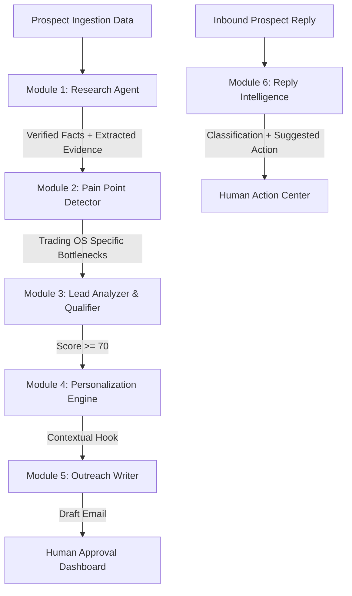

# System Architecture — Trading OS Business Automation Engine

## 1. Executive Summary & Core Mission

The **Trading OS Business Automation Engine** is a production-grade, AI-powered customer acquisition, lead qualification, and outbound growth infrastructure designed specifically for **Trading OS** (`https://trading-os-blue.vercel.app`).

Trading OS is an advanced quantitative trading research, strategy validation, and risk analysis platform (featuring 3-state Gaussian HMM market regime modeling, walk-forward analysis, Monte Carlo stress testing, and Pine Script v5 export). 

The primary mission of this automation engine is **high-relevance customer acquisition**:
1. Discover high-conviction Ideal Customer Profile (ICP) prospects (algorithmic traders, quantitative researchers, TradingView/Pine Script engineers, and systematic trading teams).
2. Deeply research their verifiable public activity and trading background without hallucination.
3. Quantitatively score and qualify leads using deterministic heuristics and Gemini AI structured reasoning.
4. Generate highly contextual, low-pressure, technically credible outreach drafts.
5. Enforce strict **Human-in-the-Loop (HITL)** approval before any communication reaches delivery.
6. Synchronize approved leads with **Instantly** for cold email execution.
7. Ingest and classify prospect replies via **Gemini Reply Intelligence** with instant handling of opt-outs and interest signals.
8. Deliver real-time funnel analytics and audit trails across the entire customer acquisition lifecycle.

---

## 2. End-to-End System Pipeline

```mermaid
flowchart TD
    subgraph "1. Ingestion & Discovery"
        A[Apollo API Search / Lead Discovery] --> B[Lead Normalization Engine]
        B --> C{Deduplication & Validation}
        C -- Duplicate / Invalid --> D[Archive / Event Logged]
        C -- Unique & Valid --> E[Supabase DB: 'leads' (Status: NEW)]
    end

    subgraph "2. Intelligence & Qualification"
        E --> F[Lead Research Worker]
        F --> G[Gemini Research Agent v1]
        G --> H[Supabase DB: 'research']
        H --> I[Lead Scoring Worker]
        I --> J[Deterministic Rules + Gemini Lead Analyzer v1]
        J --> K[Supabase DB: 'ai_analysis']
        K --> L{Qualification Gate}
        L -- Score < 50 --> M[Status: REJECTED]
        L -- Score 50-69 --> N[Status: REVIEW]
        L -- Score >= 70 --> O[Status: QUALIFIED / HIGH_PRIORITY]
    end

    subgraph "3. Outreach Generation & Human Approval"
        O --> P[Outreach Generation Worker]
        P --> Q[Gemini Personalization & Outreach Writer v1]
        Q --> R[Supabase DB: 'outreach' (Status: PENDING_APPROVAL)]
        R --> S[Admin Dashboard: Outreach Approval UI]
        S -- Human Rejects / Edits / Approves --> T{Human Decision}
        T -- Rejected --> U[Status: REJECTED]
        T -- Approved --> V[Status: APPROVED]
    end

    subgraph "4. Delivery & Webhook Processing"
        V --> W[Instantly Sync Worker]
        W --> X[Instantly API: Add Lead to Campaign]
        X --> Y[Email Delivered to Prospect]
        Y --> Z[Prospect Email Reply]
        Z --> AA[Instantly Webhook Receiver]
        AA --> AB[Webhook Verification & Idempotency Check]
        AB --> AC[Supabase DB: 'replies' & 'events']
    end

    subgraph "5. Reply Intelligence & Action"
        AC --> AD[Reply Intelligence Worker]
        AD --> AE[Gemini Reply Classifier v1]
        AE --> AF{Reply Classification}
        AF -- UNSUBSCRIBE --> AG[Immediate Global Opt-Out & Campaign Blacklist]
        AF -- INTERESTED / QUESTION --> AH[Human Notification & Drafted Response]
        AF -- NOT_NOW / OOO --> AI[Follow-up Rescheduled]
        AF --> AJ[Analytics Aggregator & Funnel Telemetry]
    end
```

---

## 3. High-Level Modular Monorepo Architecture

The codebase is organized as a clean, typed TypeScript modular application with decoupled packages, independent background workers, structured database migrations, versioned prompts, and an interactive human-in-the-loop dashboard.

```text
BuisnessAutomation/
│
├── apps/
│   ├── api/                           # REST API & Webhook Ingestion Service
│   │   ├── src/
│   │   │   ├── routes/                # Route handlers (leads, outreach, webhooks, analytics)
│   │   │   ├── middleware/            # Auth, rate limiting, logging, error handling
│   │   │   └── server.ts              # Fastify / Express bootstrap
│   │   └── package.json
│   │
│   └── dashboard/                     # Next.js / React Human-in-the-Loop Admin UI
│       ├── src/
│       │   ├── app/                   # App router pages (dashboard, leads, approval, replies)
│       │   ├── components/            # Data tables, email preview cards, diff editors
│       │   └── lib/                   # API client hooks
│       └── package.json
│
├── packages/
│   ├── shared/                        # Common TypeScript types, enums, schemas, constants
│   ├── database/                      # Supabase client, repositories, and query builders
│   ├── logging/                       # Structured JSON logger (Pino) with correlation IDs
│   ├── apollo/                        # Apollo REST client, rate limiters, normalizers
│   ├── gemini/                        # Google Gemini SDK wrapper, structured output validator
│   ├── instantly/                     # Instantly API client & webhook signature verifier
│   ├── research/                      # Lead enrichment & factual evidence extraction
│   └── scoring/                       # Deterministic scoring matrix & composite score engine
│
├── workers/
│   ├── lead-discovery/                # Ingests prospects from Apollo / CSV imports
│   ├── lead-research/                 # Orchestrates Gemini research queries
│   ├── lead-scoring/                  # Computes deterministic and AI relevance scores
│   ├── outreach-generation/           # Synthesizes personalized email copy
│   ├── instantly-sync/                # Pushes approved leads to Instantly campaigns
│   ├── reply-analysis/                # Ingests webhook payloads and runs reply intelligence
│   └── analytics/                     # Computes cohort performance, funnel drop-off, AI accuracy
│
├── database/
│   ├── migrations/                    # Sequential PostgreSQL DDL migration scripts
│   └── seed/                          # Local development fixtures & sample test leads
│
├── prompts/                           # Version-controlled prompt engineering registry
│   ├── lead-analyzer/                 # v1, v2 prompts for qualification scoring
│   ├── researcher/                    # v1 prompts for extracting factual evidence
│   ├── pain-point-detector/           # v1 prompts for identifying trading bottlenecks
│   ├── personalization/               # v1 prompts for contextual icebreakers
│   ├── outreach/                      # v1 prompts for cold email draft generation
│   └── reply-intelligence/            # v1 prompts for sentiment & intent classification
│
├── docs/                              # Technical specifications & implementation guides
│   ├── ARCHITECTURE.md                # Master system architecture (this document)
│   └── IMPLEMENTATION_PLAN.md         # Phased milestone delivery roadmap
│
├── tests/
│   ├── unit/                          # Unit tests (scoring, deduplication, normalizers, schema validation)
│   ├── integration/                   # Mocked API integration tests (Apollo, Gemini, Instantly, DB)
│   └── fixtures/                      # Mock payloads (Apollo leads, webhooks, Gemini outputs)
│
├── .env.example                       # Documented environment configuration template
├── .gitignore                         # Comprehensive secrets and build exclusion rules
└── README.md                          # Repository overview & quickstart guide
```

---

## 4. Ideal Customer Profiles (ICPs) for Trading OS

The automation engine targets four precise personas where Trading OS solves critical quantitative bottlenecks:

### Segment A: Independent Quantitative & Algorithmic Traders (Primary)
- **Profile:** Traders writing Python/C++ backtests, executing automated strategies via broker APIs (Interactive Brokers, Alpaca, Binance).
- **Core Pains:** Overfitting, curve-fitting bias, lack of market regime classification, insufficient Monte Carlo stress testing, tedious manual backtest logging.
- **Trading OS Hook:** 3-state Gaussian HMM regime detection, out-of-sample Walk-Forward Efficiency (WFE) metrics, slippage stress testing.

### Segment B: Pine Script & TradingView Strategy Developers (Primary)
- **Profile:** Authors of TradingView indicators/strategies, PineCoders community members, freelance Pine Script developers.
- **Core Pains:** Inability to perform true Monte Carlo simulations inside TradingView, limited regime-dependent parameter testing, lack of institutional health scoring.
- **Trading OS Hook:** Direct Pine Script v5 export, automated sensitivity analysis, strategy health auditing.

### Segment C: Trading Educators & Research Community Leaders (Secondary)
- **Profile:** Educators teaching systematic trading methodologies, quant YouTube/Substack creators, Discord trading lab owners.
- **Core Pains:** Need clear visual diagnostics, strategy weakness audits, and shareable research journals for students.
- **Trading OS Hook:** Visual trade expectancy logs, interactive parameter plateaus, research journaling.

### Segment D: Boutique Quant Funds & Prop Trading Teams (Secondary)
- **Profile:** 2–10 person prop firms validating multi-asset quantitative models.
- **Core Pains:** Rigorous out-of-sample risk modeling, drawdown duration analytics, payoff asymmetry validation.
- **Trading OS Hook:** Standardized strategy versioning and institutional risk audits.

---

## 5. Relational Database Schema & Data Models (Supabase / PostgreSQL)

The database schema guarantees **strict relational integrity, full auditability, and idempotent operations**.



### Table Definitions & Constraints
1. **`campaigns`**: Holds outreach initiatives organized by ICP segments and linked to Instantly campaign IDs.
2. **`leads`**: Master registry. Enforces unique constraint on `email` and `(source, source_id)` to prevent duplicate ingestion.
3. **`research`**: Factual research dossiers generated from Apollo data, web profiles, and verified metadata.
4. **`ai_analysis`**: Structured qualification records with dimensional breakdown scores (role, company, problem, evidence).
5. **`outreach`**: Email drafts created by Gemini. Tracks states: `DRAFT` $\rightarrow$ `PENDING_APPROVAL` $\rightarrow$ `APPROVED` (or `REJECTED`) $\rightarrow$ `SENT`.
6. **`replies`**: Stores incoming prospect replies, sentiment classifications, action recommendations, and generated reply drafts.
7. **`events`**: Append-only audit trail logging every state transition (`LEAD_IMPORTED`, `RESEARCH_COMPLETED`, `OUTREACH_APPROVED`, etc.).

---

## 6. Deterministic & AI Lead Scoring Engine

The scoring engine blends **deterministic heuristics** (hard business rules) with **Gemini structured evaluation** to eliminate hallucinations while maintaining deep context awareness.

### Scoring Formula:
$$\text{Composite Score} = (0.35 \times \text{Role Relevance}) + (0.25 \times \text{Company Fit}) + (0.20 \times \text{Problem Relevance}) + (0.20 \times \text{Evidence Strength})$$

```mermaid
graph LR
    subgraph "Input Data"
        R[Lead Title & Seniority]
        C[Company Size & Industry]
        E[Public Activity & Keywords]
    end

    subgraph "Deterministic Rules (0-100)"
        D1[Keywords: Quant, Algo, Backtesting, Pine Script] --> S1[Base Role Score]
        D2[Excluded: Retail manual scalpers, HR, General Sales] --> S2[Hard Negative Filter]
    end

    subgraph "Gemini Structured Evaluation (0-100)"
        G1[Role Relevance: 35%]
        G2[Company Fit: 25%]
        G3[Problem Relevance: 20%]
        G4[Evidence Strength: 20%]
    end

    S1 & S2 & G1 & G2 & G3 & G4 --> COMP[Composite Score (0 - 100)]
    
    COMP --> T1{Score Range}
    T1 -- "85 - 100" --> P1[HIGH_PRIORITY]
    T1 -- "70 - 84" --> P2[QUALIFIED]
    T1 -- "50 - 69" --> P3[REVIEW]
    T1 -- "0 - 49" --> P4[REJECT]
```

---

## 7. Gemini AI Intelligence Modules

All Gemini interactions use Google's official Gemini SDK (`@google/genai` or `@google/generative-ai`) with **Strict JSON Schema Enforcement** and **Zod runtime validation**.



### Module Breakdown:
1. **Module 1 — Research Agent:** Scans prospect bio, company domain, public repo/social context. Categorizes facts into `verified_fact`, `reasonable_inference`, or `unknown`.
2. **Module 2 — Pain Point Detector:** Identifies specific quantitative pain points (e.g. regime instability, Pine Script limitations, overfitting risk).
3. **Module 3 — Lead Analyzer:** Evaluates ICP fit against the four dimensions and produces the structured qualification score.
4. **Module 4 — Personalization Engine:** Crafts a single, non-creepy, technically relevant sentence linking the prospect's verified background to Trading OS.
5. **Module 5 — Outreach Writer:** Generates a concise (<100 words), low-pressure cold email draft adhering to the Anti-Hype rules.
6. **Module 6 — Reply Intelligence:** Analyzes prospect replies to categorize intent (`INTERESTED`, `VERY_INTERESTED`, `QUESTION`, `NOT_NOW`, `NOT_INTERESTED`, `UNSUBSCRIBE`, `OUT_OF_OFFICE`, `WRONG_PERSON`, `BOUNCE`, `OTHER`).

### Anti-Hallucination & Privacy Standards:
- If evidence for a prospect's tech stack is missing, the field value MUST be explicitly set to `unknown`.
- Never make assumptions about personal life, private assets, or fabricated company achievements.
- Emails must include straightforward opt-out provisions and respect all privacy/anti-spam regulations.

---

## 8. External Service Integrations

### 8.1 Apollo Client (`packages/apollo`)
- **API Endpoint:** Apollo REST API (`/v1/mixed_people/search`)
- **Rate Limiting:** Leaky-bucket rate limiter (maximum 10 requests/sec with exponential backoff).
- **Data Normalization:** Maps Apollo raw responses to internal typed `Lead` interfaces.
- **Idempotency:** Checks `source_id` against Supabase before ingestion to eliminate duplicates.

### 8.2 Google Gemini Client (`packages/gemini`)
- **Model:** Configurable via environment (default: `gemini-2.5-flash` or `gemini-1.5-pro` for deep reasoning).
- **Temperature:** Low temperature ($0.1 - 0.2$) for qualification and analysis; moderate ($0.4$) for email drafting.
- **Schema Validation:** Every response is validated using Zod. On schema failure, automatic repair/retry is triggered up to 2 times before gracefully failing the lead.

### 8.3 Instantly Client (`packages/instantly`)
- **API Endpoint:** Instantly v2 API (`/api/v2/campaigns`, `/api/v2/leads`)
- **Lead Sync:** Syncs only human-approved leads (`status = APPROVED`).
- **Safety Checks:** Verifies global unsubscribe list before payload dispatch.

### 8.4 Webhook Handling (`apps/api`)
- **Endpoint:** `/api/v1/webhooks/instantly`
- **Idempotency:** Logs incoming webhook ID in `events`. Discards duplicate event deliveries.
- **Immediate Opt-Out:** If `event_type == 'unsubscribe'` or reply classification is `UNSUBSCRIBE`, sets `opted_out = true` immediately across all active campaigns.

---

## 9. Security, Configuration & Observability

### 9.1 Environment & Secrets Management
- All secrets are injected via environment variables. Real credentials are never checked into version control.
- Supported variables:
  - `GEMINI_API_KEY`: API key for Google Gemini
  - `APOLLO_API_KEY`: API key for Apollo prospect discovery
  - `INSTANTLY_API_KEY`: API key for Instantly cold email campaigns
  - `SUPABASE_URL`: Supabase project URL
  - `SUPABASE_SERVICE_ROLE_KEY`: Supabase server-side administrative key
  - `INSTANTLY_WEBHOOK_SECRET`: HMAC secret for webhook signature verification
  - `PORT`: API server port (default: 4000)
  - `LOG_LEVEL`: Logging verbosity (`debug`, `info`, `warn`, `error`)

### 9.2 Observability & Audit Trail
- Structured JSON logging with correlation IDs (`correlation_id`, `lead_id`, `job_id`).
- Real-time event tracking in `events` table for full lifecycle debugging.
- Healthcheck endpoint (`/health`) with latency metrics for DB, Gemini, Apollo, and Instantly connections.

---

## 10. Human-in-the-Loop (HITL) Workflow

No email is sent automatically in the MVP. Every generated outreach email passes through the **Outreach Approval Portal**:

```text
[ Lead Profile Card ]
  Name: Alex Mercer | Title: Quantitative Strategist | Company: AlphaEdge Trading
  Score: 88/100 (HIGH PRIORITY) | ICP: Segment A (Algorithmic Trader)
  
[ Factual Research Evidence ]
  - Public repository indicates active work on HMM regime detection & Python backtesting.
  - Potential Pain Point: Overfitting on regime shifts, lack of out-of-sample stress testing.

[ Generated Cold Outreach Draft (v1.0) ]
  Subject: HMM regime stress-testing for AlphaEdge strategies
  Body:
    Hi Alex,
    
    Noticed your work on quantitative strategy development and regime shifts.
    
    I'm building Trading OS (trading-os-blue.vercel.app), a research platform designed to 
    stress-test systematic strategies against Gaussian HMM market regimes and Monte Carlo 
    drawdown simulations.
    
    We're onboarding a small cohort of serious quant researchers to test our regime validation 
    engine and share feedback. Would you be open to taking a look?
    
    Best,
    Khalid

[ Actions ]
  [ ✅ Approve & Sync to Instantly ]   [ ✏️ Edit Copy ]   [ 🔄 Regenerate Prompt ]   [ ❌ Reject Lead ]
```

---

## 11. Technology Stack Summary

| Layer | Technology | Purpose |
| :--- | :--- | :--- |
| **Runtime & Language** | Node.js 20+ / TypeScript 5.4+ (ESM) | Type safety, concurrency, clean modern architecture |
| **API Framework** | Fastify / Express (TypeScript) | High-performance REST endpoints and webhook listeners |
| **Database & Auth** | Supabase (PostgreSQL 16) | Relational storage, migrations, row-level security |
| **AI Intelligence** | Google Gemini API (`@google/genai`) | Research, scoring, personalization, reply classification |
| **Lead Discovery** | Apollo REST API | Prospect retrieval and firmographic filtering |
| **Outreach Delivery** | Instantly API & Webhooks | Safe email sending, delivery tracking, reply webhooks |
| **Validation** | Zod | Runtime schema validation for API inputs and AI responses |
| **Logging** | Pino | High-speed structured JSON logging with correlation IDs |
| **Dashboard UI** | Next.js 15 / React 19 / Tailwind CSS | Fast, human-in-the-loop approval and analytics dashboard |
| **Testing** | Vitest / Jest | Unit testing, integration mocking, prompt schema tests |
