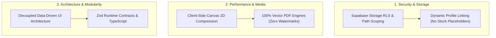

# 🛠️ Engineering Standards, Security & Performance Guidelines

This section documents production software engineering standards, security hardening protocols, asset management pipelines, and clean architecture conventions authored by **Khalid Abdullah**.

---

## 🏛️ Engineering Quality Dimensions

---

## 📚 Technical Standards & Guides

1. **Storage Security & Avatars:**
   - [`engineering/security/storage-bucket-rls-and-dynamic-avatars.md`](./security/storage-bucket-rls-and-dynamic-avatars.md): Supabase storage bucket RLS policies, authenticated upload paths, and dynamic profile avatar resolution in leaderboards.
2. **High-Fidelity PDF & Image Processing:**
   - [`engineering/performance/vector-pdf-and-client-compression.md`](./performance/vector-pdf-and-client-compression.md): Pure vector PDF generation techniques vs HTML canvas screenshot rasterization.
3. **Decoupled Architecture:**
   - [`engineering/clean-architecture/data-driven-ui-layering.md`](./clean-architecture/data-driven-ui-layering.md): Multi-layer Single Page Architecture with isolated data layers, reactive views, and hardware-accelerated canvas components.
