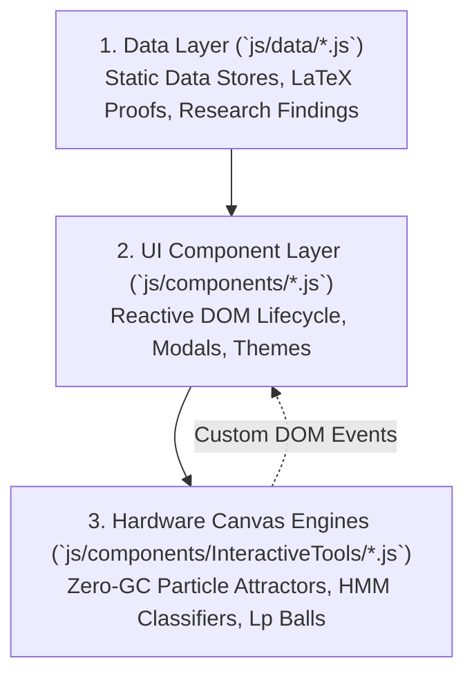

# 🏛️ Data-Driven UI Architecture & Component Decoupling

**Topic:** High-Performance Single Page Architecture, Data Separation & Zero-GC Event Coordination  
**Reference Implementations:** Khalid Abdullah Digital Lab & Innovation Hub  
**Author:** Khalid Abdullah  

---

## 📌 Architectural Triad

To maintain long-term maintainability without complex build bundler lock-in, the digital lab architecture enforces a strict tripartite separation:

---

## ⚡ 1. Decoupled Data Layer Principle
- UI templates never hardcode project metrics or experiment text.
- Adding a new research experiment, project, tool, or knowledge note is as simple as appending a typed object into `js/data/`.
- The UI layer reads directly from immutable data exports, ensuring zero runtime data mutability bugs.
