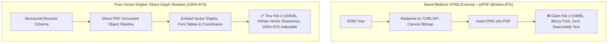

# 🖨️ Pure Vector PDF Generation & Client-Side Media Compression

**Topic:** High-Fidelity Vector Document Compilation vs Canvas Rasterization & In-Browser Image Optimization  
**Reference Implementations:** AI CV Builder v2.0  
**Author:** Khalid Abdullah  

---

## 📌 Vector Compilation vs HTML Canvas Screenshots



---

## 🖼️ 1. Client-Side Image Compression Pipeline

Before uploading avatars or embedding them into PDF streams, client browsers compress images directly using HTML5 Canvas 2D:

```typescript
export async function compressImageClient(file: File, maxDimension = 600, quality = 0.85): Promise<Blob> {
  return new Promise((resolve, reject) => {
    const reader = new FileReader();
    reader.readAsDataURL(file);
    reader.onload = (e) => {
      const img = new Image();
      img.src = e.target?.result as string;
      img.onload = () => {
        const canvas = document.createElement("canvas");
        let { width, height } = img;

        if (width > height && width > maxDimension) {
          height = Math.round((height * maxDimension) / width);
          width = maxDimension;
        } else if (height > maxDimension) {
          width = Math.round((width * maxDimension) / height);
          height = maxDimension;
        }

        canvas.width = width;
        canvas.height = height;
        const ctx = canvas.getContext("2d");
        ctx?.drawImage(img, 0, 0, width, height);

        canvas.toBlob(
          (blob) => (blob ? resolve(blob) : reject(new Error("Compression failed"))),
          "image/webp",
          quality
        );
      };
    };
    reader.onerror = reject;
  });
}
```
