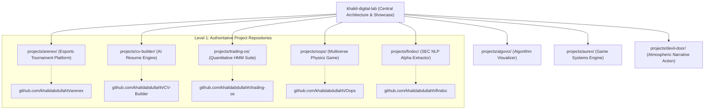

# ⚡ Engineered Projects Registry

This directory contains in-depth architectural case studies, system designs, and technical breakdowns of production applications, platforms, and research prototypes engineered by **Khalid Abdullah**.

---

## 🏛️ Two-Level Portfolio Architecture

> **Architecture Principle:** Each individual project repository is the authoritative source of its production code, database migrations, and deployment configs. This central showcase provides technical breakdowns, system diagrams, and cross-project knowledge synthesis.

---

## 📁 Projects Directory Matrix

| Project | Category | Key Technologies | Status | Architecture Case Study | Authoritative Repository |
| :--- | :--- | :--- | :--- | :--- | :--- |
| **ARENEX** | Esports Tournament Platform & Web App | Next.js 15+, React 19, Supabase, PostgreSQL, RLS, Tailwind CSS | Active / Live | [View Case Study](./arenex/) | [ARENEX Repo ↗](https://github.com/khalidabdullahh) |
| **AI CV Builder v2.0** | Career AI & Vector PDF Platform | Next.js 16, React 19, Google Gemini AI, PDF Engine, Tailwind CSS | Shipped / Production | [View Case Study](./cv-builder/) | [CV-Builder Repo ↗](https://github.com/khalidabdullahh/CV-Builder) |
| **Trading OS / Market Suite** | Quantitative Finance & ML | Python, Hidden Markov Models, NumPy, Pandas, Canvas 2D, FastAPI | Active Development | [View Case Study](./trading-os/) | [Trading OS Repo ↗](https://github.com/khalidabdullahh) |
| **Oops! (Chaos Realm)** | Game Systems & Physics Engine | Phaser 2D, JavaScript ES6, Web Audio API, Zero-GC Engine | Shipped / Live | [View Case Study](./oops/) | [Oops Repo ↗](https://github.com/khalidabdullahh/Oops) |
| **FinDoc** | NLP & Financial Information Retrieval | PyTorch, LangChain, Hugging Face, ChromaDB, FastAPI | Research Prototype | [View Case Study](./findoc/) | [FinDoc Repo ↗](https://github.com/khalidabdullahh) |
| **AlgoViz** | Algorithms & Interactive Education | JavaScript ES6, HTML5 Canvas 2D, Data Structures | Completed | [View Case Study](./algoviz/) | [AlgoViz Repo ↗](https://github.com/khalidabdullahh) |
| **AUREX** | Game Systems & Real-Time State Architecture | C# / Unity / Modern Engine, State Machines | Engineering Prototype | [View Case Study](./aurex/) | [AUREX Repo ↗](https://github.com/khalidabdullahh) |
| **Devil's Door** | Narrative & Atmospheric Action Systems | Game Architecture, Audio/Visual State Pipeline | In Development | [View Case Study](./devil-door/) | [Devil's Door Repo ↗](https://github.com/khalidabdullahh) |

---

## 🎯 Portfolio Diversification Pillars

1. **Software & Backend Engineering:** Distributed auth, Server Actions, PostgreSQL RLS, role-based access control, schema design, and idempotent workflows ([ARENEX](./arenex/), [CV-Builder](./cv-builder/)).
2. **System Design & Performance:** Zero-GC state loops, multi-tenant tournament queues, financial privacy isolation ([System Design Guides](../system-design/)).
3. **AI & Quantitative Machine Learning:** HMM regime segmentation, SEC filing NLP alpha retrieval, vector prompt distillation ([Trading OS](./trading-os/), [FinDoc](./findoc/), [CV-Builder](./cv-builder/)).
4. **Game Systems & Creative Computing:** Real-time physics inversion, Web Audio procedural synthesis, memory-efficient game state machines ([Oops!](./oops/), [AUREX](./aurex/), [Devil's Door](./devil-door/)).
