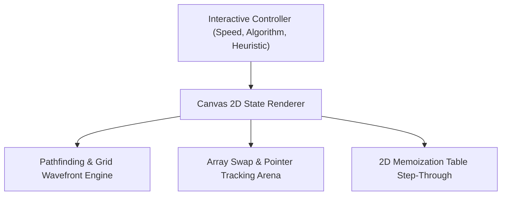

# ⚡ AlgoViz — High-Performance Algorithm & Data Structure Visualizer

**Author:** Khalid Abdullah  
**Category:** Algorithms, Data Structures & Interactive Computer Science Education  
**Core Technologies:** JavaScript ES6+, HTML5 Canvas 2D, Tailwind CSS, Data Structures  
**Authoritative Repository:** [github.com/khalidabdullahh/algoviz](https://github.com/khalidabdullahh)  

---

## 📌 Executive Summary

**AlgoViz** is a hardware-accelerated interactive workbench that visualizes graph traversals (Dijkstra, A*, BFS/DFS), sorting arenas (QuickSort, MergeSort, HeapSort), and Dynamic Programming memoization grids with controllable step-by-step state inspection and zero UI lag.

---

## 🌟 1. Features & Capabilities

- **Pathfinding Arena:** Visualizes wavefront propagation, heuristic Manhattan/Euclidean distances, and dynamic obstacle weightings.
- **Sorting Arena:** Real-time array state comparisons with step-by-step pointer markers and audio-visual swap telemetry.
- **Dynamic Programming Grid:** Step-through matrix visualization for classic problems (0/1 Knapsack, Longest Common Subsequence).
