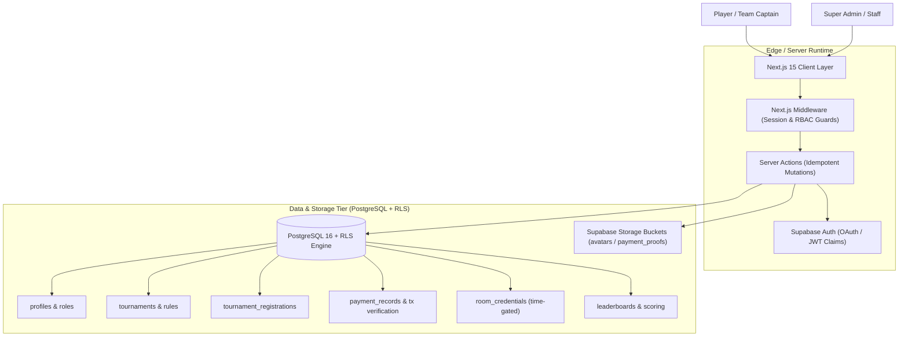
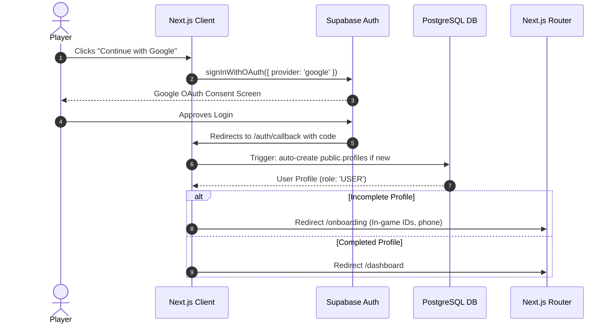
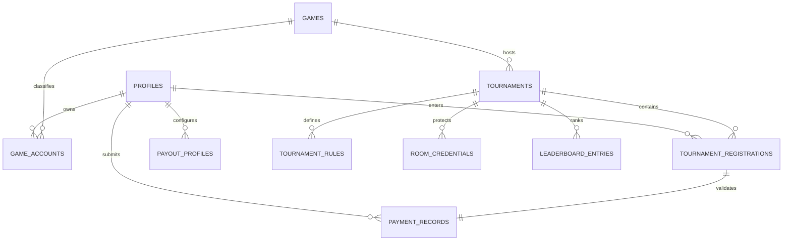
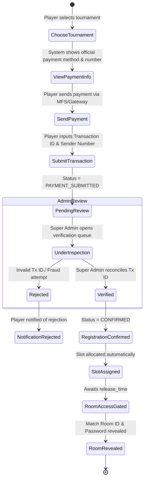
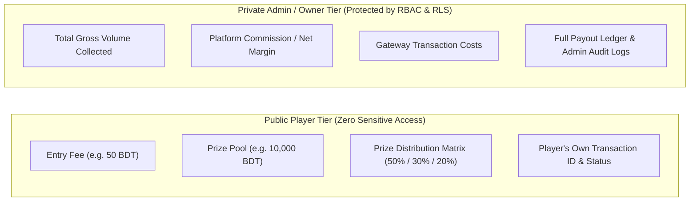
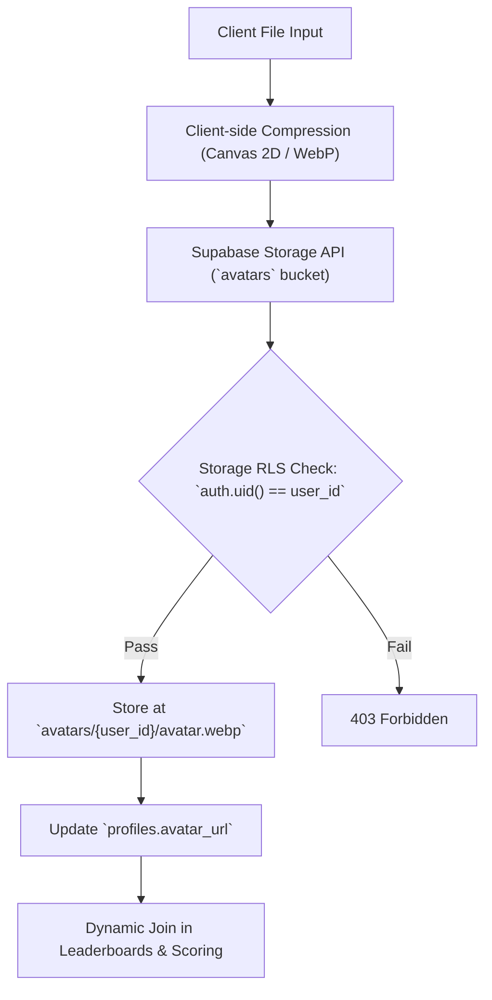

# 🏆 ARENEX — Esports Tournament & Competitive Gaming Platform

**Author:** Khalid Abdullah  
**Category:** Full-Stack Web Platform & Backend Systems  
**Authoritative Repository:** [github.com/khalidabdullahh/eSports](https://github.com/khalidabdullahh/eSports)  

---

## 📌 Executive Summary

**ARENEX** is a production-grade, multi-game esports tournament platform engineered to handle competitive match matchmaking, bracket management, automated payment verification workflows, time-gated room credential distribution, and dynamic profile-linked leaderboards. 

Unlike basic tournament landing pages, ARENEX is architected as an **authoritative server-driven application** where authentication, authorization, registration capacity limits, financial privacy, and room security are enforced directly at both the **Next.js middleware/server action layer** and the **PostgreSQL database layer via Row Level Security (RLS)**.



---

## 🏛️ 1. Platform Architecture

### 1.1 Next.js App Router Structure
ARENEX utilizes Next.js App Router with server-first rendering and co-located Server Actions:

```
app/
├── (auth)/
│   ├── login/                     # Google OAuth / Email Auth
│   ├── callback/                  # Supabase OAuth token exchange
│   └── onboarding/                # Initial gamer tag & game account setup
├── (dashboard)/
│   ├── dashboard/                 # Player overview & active tournaments
│   ├── profile/                   # Gamer profiles, game accounts, payout info
│   └── tournaments/
│       ├── page.tsx               # Filterable tournament list
│       └── [id]/
│           ├── page.tsx           # Tournament overview & rules
│           ├── register/          # Registration & payment submission flow
│           └── room/              # Gated room credentials & lobby access
├── (admin)/
│   └── admin/
│       ├── tournaments/           # Tournament CRUD & rule builders
│       ├── payments/              # Payment transaction review queue
│       ├── rooms/                 # Match lobby credential dispatch
│       └── scoring/               # Dynamic leaderboard & payout settlement
├── api/                           # Webhooks & specialized endpoints
└── middleware.ts                  # Edge session validation & role routing
```

### 1.2 Route Protection & Edge Middleware
The Next.js `middleware.ts` intercepts all incoming requests to enforce session validity and Role-Based Access Control (RBAC):
- **Public Routes:** `/`, `/tournaments`, `/rules`, `/leaderboards` (publicly readable).
- **Protected Player Routes:** `/dashboard`, `/profile`, `/tournaments/[id]/register`, `/tournaments/[id]/room`. Redirects to `/login` if unauthenticated.
- **Super Admin Routes:** `/admin/*`. Requires authenticated session with `role === 'SUPER_ADMIN'` or `role === 'OWNER'` embedded in verified user profile metadata. Unauthorized users receive an immediate `403 Forbidden` redirect.

---

## 🔐 2. Authentication & Onboarding Pipeline



### 2.1 Key Implementation Details
- **OAuth & Session Persistence:** Google OAuth integration with encrypted session cookies managed via `@supabase/ssr`.
- **Automatic Profile Trigger:** PostgreSQL `ON auth.users AFTER INSERT` database trigger automatically initializes a record in `public.profiles` with `role = 'USER'`, ensuring data consistency even if network interrupts during onboarding.
- **Onboarding Guard:** Users without verified game tags (e.g. Free Fire UID, PUBG Mobile ID, Valorant Riot ID) are locked from tournament registrations until completing the onboarding setup.

---

## 🛡️ 3. Authorization & Role Matrix

The platform enforces a hierarchical privilege model across three core roles:

| Capability | USER (Player) | SUPER_ADMIN | OWNER |
| :--- | :---: | :---: | :---: |
| Browse public tournaments & leaderboards | ✅ | ✅ | ✅ |
| Register for multiple active tournaments | ✅ | ✅ | ✅ |
| Submit payment transaction ID | ✅ | ✅ | ✅ |
| View own payment history & status | ✅ | ✅ | ✅ |
| Access room credentials (if confirmed & within time window) | ✅ | ✅ | ✅ |
| Create, update, or cancel tournaments | ❌ | ✅ | ✅ |
| Review, approve, or reject payment transactions | ❌ | ✅ | ✅ |
| Configure room credentials & release schedules | ❌ | ✅ | ✅ |
| Enter match scores & adjust leaderboards | ❌ | ✅ | ✅ |
| View platform revenue, fees & profit margins | ❌ | ❌ | ✅ |
| Assign or revoke SUPER_ADMIN privileges | ❌ | ❌ | ✅ |

---

## 🗄️ 4. PostgreSQL Database Schema & Relational Model



### 4.1 Core Table Definitions

#### `profiles`
User identity and privilege root:
- `id` (UUID, PK, FK $\rightarrow$ `auth.users.id` ON DELETE CASCADE)
- `username` (VARCHAR(50), UNIQUE, NOT NULL)
- `full_name` (TEXT)
- `avatar_url` (TEXT)
- `role` (VARCHAR(20), DEFAULT 'USER', CHECK `role IN ('USER', 'SUPER_ADMIN', 'OWNER')`)
- `phone_number` (VARCHAR(20))
- `created_at` (TIMESTAMPTZ, DEFAULT NOW())
- `updated_at` (TIMESTAMPTZ, DEFAULT NOW())

#### `games`
Supported competitive titles (e.g. Free Fire, PUBG Mobile, MLBB):
- `id` (UUID, PK)
- `slug` (VARCHAR(50), UNIQUE)
- `title` (VARCHAR(100), NOT NULL)
- `banner_url` (TEXT)
- `account_id_label` (VARCHAR(50), e.g. "Free Fire UID", "In-Game Name")

#### `game_accounts`
Player in-game identities linked to games:
- `id` (UUID, PK)
- `user_id` (UUID, FK $\rightarrow$ `profiles.id`)
- `game_id` (UUID, FK $\rightarrow$ `games.id`)
- `in_game_name` (VARCHAR(100), NOT NULL)
- `in_game_uid` (VARCHAR(100), NOT NULL)
- `is_verified` (BOOLEAN, DEFAULT FALSE)
- *Constraint:* `UNIQUE(user_id, game_id, in_game_uid)`

#### `tournaments`
Tournament configuration and lifecycle:
- `id` (UUID, PK)
- `game_id` (UUID, FK $\rightarrow$ `games.id`)
- `title` (VARCHAR(150), NOT NULL)
- `format` (VARCHAR(50), e.g. "SOLO", "DUO", "SQUAD")
- `max_participants` (INT, NOT NULL)
- `entry_fee` (NUMERIC(10,2), DEFAULT 0.00)
- `prize_pool` (NUMERIC(10,2), NOT NULL)
- `prize_distribution` (JSONB, e.g. `{"1": "50%", "2": "30%", "3": "20%"}`)
- `status` (VARCHAR(30), DEFAULT 'UPCOMING', CHECK `status IN ('DRAFT', 'REGISTRATION_OPEN', 'REGISTRATION_CLOSED', 'LIVE', 'COMPLETED', 'CANCELLED')`)
- `registration_start` (TIMESTAMPTZ)
- `registration_end` (TIMESTAMPTZ)
- `tournament_start` (TIMESTAMPTZ NOT NULL)
- `created_by` (UUID, FK $\rightarrow$ `profiles.id`)

#### `tournament_registrations`
Participant enrollment ledger:
- `id` (UUID, PK)
- `tournament_id` (UUID, FK $\rightarrow$ `tournaments.id` ON DELETE CASCADE)
- `user_id` (UUID, FK $\rightarrow$ `profiles.id`)
- `game_account_id` (UUID, FK $\rightarrow$ `game_accounts.id`)
- `status` (VARCHAR(30), DEFAULT 'PENDING_PAYMENT', CHECK `status IN ('PENDING_PAYMENT', 'PAYMENT_SUBMITTED', 'CONFIRMED', 'REJECTED', 'DISQUALIFIED')`)
- `slot_number` (INT)
- `created_at` (TIMESTAMPTZ, DEFAULT NOW())
- *Multi-Tournament Participation:* A player can register for multiple different tournaments. The constraint is `UNIQUE(tournament_id, user_id)` (one registration per tournament per user).

#### `payment_records`
Financial audit trail and transaction proof:
- `id` (UUID, PK)
- `registration_id` (UUID, FK $\rightarrow$ `tournament_registrations.id` ON DELETE CASCADE)
- `user_id` (UUID, FK $\rightarrow$ `profiles.id`)
- `payment_method` (VARCHAR(50), e.g. "bKash", "Nagad", "Rocket", "Stripe")
- `sender_number` (VARCHAR(30))
- `transaction_id` (VARCHAR(100), NOT NULL)
- `amount_paid` (NUMERIC(10,2), NOT NULL)
- `proof_screenshot_url` (TEXT)
- `status` (VARCHAR(30), DEFAULT 'PENDING', CHECK `status IN ('PENDING', 'VERIFIED', 'REJECTED')`)
- `verified_by` (UUID, FK $\rightarrow$ `profiles.id`)
- `verified_at` (TIMESTAMPTZ)
- `admin_notes` (TEXT)
- *Constraint:* `UNIQUE(payment_method, transaction_id)` (prevents transaction ID replay attacks).

#### `room_credentials`
Match lobby IDs and passwords:
- `id` (UUID, PK)
- `tournament_id` (UUID, FK $\rightarrow$ `tournaments.id` ON DELETE CASCADE)
- `room_id` (VARCHAR(100), NOT NULL)
- `room_password` (VARCHAR(100), NOT NULL)
- `release_time` (TIMESTAMPTZ NOT NULL, e.g. 15 minutes before match start)
- `notes` (TEXT, e.g. "Slot 1-12 map Bermuda, do not share outside platform")

#### `leaderboard_entries`
Match scoring and dynamic standings:
- `id` (UUID, PK)
- `tournament_id` (UUID, FK $\rightarrow$ `tournaments.id` ON DELETE CASCADE)
- `user_id` (UUID, FK $\rightarrow$ `profiles.id`)
- `rank` (INT NOT NULL)
- `kills` (INT DEFAULT 0)
- `placement_points` (NUMERIC(8,2) DEFAULT 0)
- `total_points` (NUMERIC(8,2) NOT NULL)
- `prize_won` (NUMERIC(10,2) DEFAULT 0.00)

---

## 🔒 5. Row Level Security (RLS) Architecture

All tables in ARENEX enable PostgreSQL RLS. Access is enforced at the database level:

```sql
-- 1. Profiles: Public can read usernames & avatars; Users edit their own; Super Admins manage roles
ALTER TABLE public.profiles ENABLE ROW LEVEL SECURITY;

CREATE POLICY "Public profiles are viewable by everyone" 
  ON public.profiles FOR SELECT USING (true);

CREATE POLICY "Users can update own profile" 
  ON public.profiles FOR UPDATE USING (auth.uid() = id);

-- 2. Tournament Registrations: Users view own or public confirmed roster; Only Super Admins modify
ALTER TABLE public.tournament_registrations ENABLE ROW LEVEL SECURITY;

CREATE POLICY "Users can view own registrations" 
  ON public.tournament_registrations FOR SELECT 
  USING (auth.uid() = user_id OR EXISTS (
    SELECT 1 FROM public.profiles WHERE id = auth.uid() AND role IN ('SUPER_ADMIN', 'OWNER')
  ));

CREATE POLICY "Users can insert own registrations" 
  ON public.tournament_registrations FOR INSERT 
  WITH CHECK (auth.uid() = user_id);

-- 3. Room Credentials: Only confirmed participants within release time OR Super Admins
ALTER TABLE public.room_credentials ENABLE ROW LEVEL SECURITY;

CREATE POLICY "Confirmed participants view room credentials after release time" 
  ON public.room_credentials FOR SELECT 
  USING (
    EXISTS (
      SELECT 1 FROM public.profiles WHERE id = auth.uid() AND role IN ('SUPER_ADMIN', 'OWNER')
    ) OR (
      NOW() >= release_time AND EXISTS (
        SELECT 1 FROM public.tournament_registrations tr
        WHERE tr.tournament_id = room_credentials.tournament_id
          AND tr.user_id = auth.uid()
          AND tr.status = 'CONFIRMED'
      )
    )
  );

-- 4. Payment Records: Strict financial isolation
ALTER TABLE public.payment_records ENABLE ROW LEVEL SECURITY;

CREATE POLICY "Users can view and insert their own payment records" 
  ON public.payment_records FOR SELECT 
  USING (auth.uid() = user_id);

CREATE POLICY "Users insert payment with their own ID" 
  ON public.payment_records FOR INSERT 
  WITH CHECK (auth.uid() = user_id);

CREATE POLICY "Super Admins can view and update all payment records" 
  ON public.payment_records FOR ALL 
  USING (EXISTS (
    SELECT 1 FROM public.profiles WHERE id = auth.uid() AND role IN ('SUPER_ADMIN', 'OWNER')
  ));
```

---

## 💳 6. Payment & Verification Workflow



### 6.1 State Verification Steps
1. **Player Selects Tournament:** Checks registration dates and slot availability.
2. **Official Payment Instructions:** Displays verified merchant/personal numbers and copyable instructions.
3. **Transaction Submission:** Player submits `transaction_id`, `sender_number`, and optional screenshot.
4. **Pending Verification Queue:** Enters `/admin/payments` queue for review.
5. **Admin Approval/Rejection:** Super Admin verifies ledger match.
6. **Confirmation & Gated Room Release:** Status updates to `CONFIRMED`. When `NOW() >= release_time`, the room ID and password unlock.

---

## 🛡️ 7. Financial Privacy Isolation

To safeguard business metrics and player trust, ARENEX strictly partitions public tournament financials from internal platform accounting:



---

## 🖼️ 8. Image & Storage Architecture (Dynamic Avatars)



### 8.1 Key Storage Policies
- **Bucket Configuration:** `avatars` bucket is configured with public read access but authenticated write access.
- **Upload Path Scoping:** Players can only upload to paths matching `avatars/${auth.uid()}/*`.
- **Dynamic Leaderboard Avatars:** Leaderboard standings dynamically perform relational joins with `public.profiles`, guaranteeing that rank standings always reflect real player avatars rather than placeholder stock images.

---

## 🚀 9. Deployment & Production Operations

- **Hosting:** Next.js deployed on Vercel with automatic Edge route caching for public tournament lists.
- **Database:** Supabase Managed PostgreSQL with pooled connections via Supabase PgBouncer.
- **Continuous Integration:** GitHub Actions linting and automated RLS regression testing.
