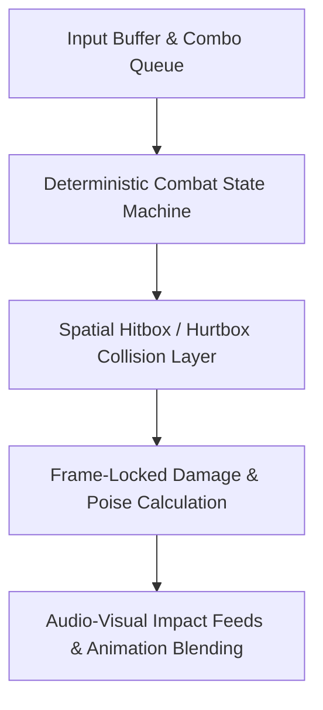

# ⚔️ AUREX — Real-Time Game Systems & Mechanics Engine

**Author:** Khalid Abdullah  
**Category:** Game Systems, Real-Time Architecture & Physics  
**Core Technologies:** C# / Modern Engine Architecture, State Machines, Procedural Systems  
**Authoritative Repository:** [github.com/khalidabdullahh/AuRex](https://github.com/khalidabdullahh/AuRex)  

---

## 📌 Executive Summary

**AUREX** is a high-performance game engineering framework and tactical action combat prototype focused on deterministic combat state resolution, hitbox/hurtbox spatial indexing, and modular entity-component architectures.

---

## 🏛️ 1. Core Architectural Systems

- **Input Buffering & Frame Windows:** Implements a fixed frame queue that buffers player commands during active animation frames to ensure responsive combo chaining.
- **Hierarchical State Machines:** Decouples movement states (grounded, aerial, dodging) from combat action states (windup, active, recovery).
- **Spatial Collision Partitioning:** High-efficiency bounding box queries for multi-entity melee and projectile interactions.
