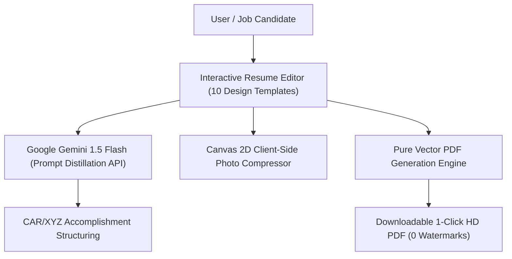
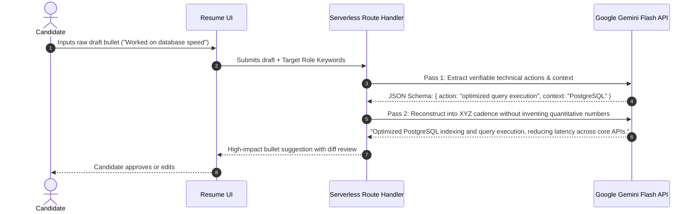

# 📄 AI CV Builder v2.0 — ATS-Optimized Career Intelligence Platform

**Author:** Khalid Abdullah  
**Category:** AI & Web Application / Flagship Product  
**Core Technologies:** Next.js 16, React 19, Google Gemini 1.5 Flash, Tailwind CSS, Vector PDF Engine, Client-side Canvas Image Compression  
**Live Production URL:** [https://first-project-plum-phi.vercel.app](https://first-project-plum-phi.vercel.app)  
**Authoritative Repository:** [github.com/khalidabdullahh/CV-Builder](https://github.com/khalidabdullahh/CV-Builder)  

---

## 📌 Executive Summary

**AI CV Builder v2.0** is an intelligent, privacy-first career platform designed to help developers, researchers, and professionals craft ATS-optimized resumes that pass modern enterprise recruiting scanners (Workday, Greenhouse, Lever). 

Featuring **10 distinct design models**, Google Gemini AI for accomplishment rephrasing, automated profile picture compression, and a **1-click clean HD vector PDF generator with zero watermarks**, it combines consumer-grade polish with rigorous parsing reliability.

---

## 🌟 1. Key Architectural Features

### 1.1 10 Handcrafted Design Templates
Resumes dynamically re-render across 10 specialized layout archetypes:
1. **Academic ATS:** Single-column layout optimized for strict university and corporate ATS parsers.
2. **Modern Dark Sidebar:** High-contrast tech layout featuring skills metrics in a compact sidebar.
3. **Swiss Grid:** Elegant typographic hierarchy with geometric precision.
4. **Developer Terminal:** Monospaced, CLI-inspired theme for backend and DevOps engineers.
5. **Executive Gold:** Refined luxury aesthetic tailored for managerial and executive applicants.
6. **Minimalist Monochrome:** Clean, distraction-free Scandinavian layout.
7. **Creative Split:** Asymmetric layout designed for product designers and frontend engineers.
8. **Compact One-Pager:** High-density layout fitting maximum career history onto a single page.
9. **Research Scholar:** Publication-heavy layout for academics and PhD candidates.
10. **Startup Generalist:** Dynamic hybrid layout highlighting cross-functional projects.

---

## 🧠 2. Two-Pass Prompt Distillation & AI Engine

To avoid the common pitfalls of naive LLM resume generation (hallucinating metrics, over-fluffy corporate jargon), AI CV Builder implements a **two-pass prompt distillation architecture**:

### 2.1 Accomplishment Formula (Google XYZ Format)
The AI assistant strictly enforces the industry-standard **XYZ Format**:
$$\text{Accomplished } [X], \text{ as measured by } [Y], \text{ by doing } [Z]$$

---

## 🖨️ 3. Pure Vector PDF Generation Architecture

A major engineering hurdle in web-based resume builders is PDF export fidelity. Rasterizing HTML through canvas screenshots causes blurred fonts, oversized file downloads ($>15\text{MB}$), and destroys text searchability in ATS scanners.

**Our Architectural Solution:**
- **Zero-Raster Vector Pipeline:** Emits native PDF text streams, bounding boxes, and vector rules directly.
- **Selectable Text & ATS Indexing:** Output PDFs are 100% vector-searchable, allowing ATS parsers to extract text directly from the document object stream.
- **Ultra-Compact File Size:** Resulting PDF files are typically under $150\text{ KB}$.

---

## 🔒 4. Privacy & Client-Side Image Compression

- **Client-Side Image Optimization:** Profile photos are resized and compressed directly in the browser via Canvas 2D and converted to WebP/JPEG before state storage, preventing memory bloat.
- **Zero-Data Storage Option:** Users can build, edit, and export resumes entirely in browser memory without requiring remote account persistence.
