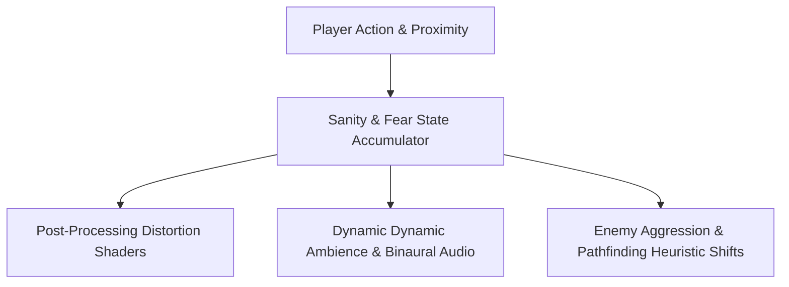

# 🚪 Devil's Door — Atmospheric Narrative & Action Mechanics Framework

**Author:** Khalid Abdullah  
**Category:** Game Engineering, Narrative State Systems & Dynamic Lighting  
**Core Technologies:** Modern Game Frameworks, Interactive Dialogue State Graphs, Dynamic Shaders  
**Authoritative Repository:** [github.com/khalidabdullahh/devil-door](https://github.com/khalidabdullahh)  

---

## 📌 Executive Summary

**Devil's Door** is an atmospheric horror-action engineering project exploring dynamic sanity state machines, branching dialogue state graphs, and ambient audio-visual distortion shaders responsive to player proximity and psychological stress levels.

---

## 🧠 1. Core Systems

- **Psychological Sanity FSM:** Modulates screen vignette, chromatic aberration, and audio pitch in response to darkness duration and hazard proximity.
- **Dynamic Branching Graphs:** Event-driven dialogue and interaction system maintaining narrative state across game chapters.
- **Adaptive AI Pathfinding:** Enemy sensory perception (hearing radius, vision cone) that expands dynamically as player panic increases.
