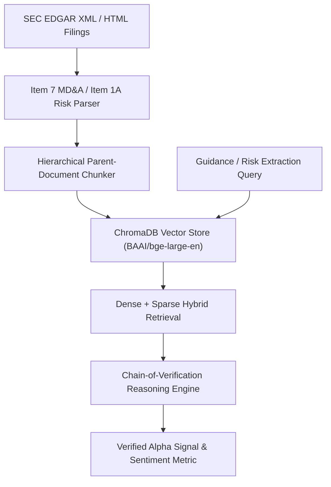

# 🔍 FinDoc — LLM Financial Alpha Extractor & SEC Disclosure Parser

**Author:** Khalid Abdullah  
**Category:** AI, Natural Language Processing & Financial Information Retrieval  
**Core Technologies:** PyTorch, LangChain, Hugging Face Embeddings, ChromaDB, FastAPI, Python  
**Authoritative Repository:** [github.com/khalidabdullahh/findoc](https://github.com/khalidabdullahh)  

---

## 📌 Executive Summary

**FinDoc** is an NLP research pipeline and semantic extraction engine designed to parse dense SEC 10-K and 10-Q corporate financial filings. By utilizing hierarchical parent-document vector retrieval, tabular serialization, and **Chain-of-Verification (CoVe)** prompt chains, FinDoc extracts management forward-looking guidance, risk exposure sentiment, and correlates disclosure changes with **Post-Earnings Announcement Drift (PEAD)**.

---

## 🔬 1. Architectural Innovations

### 1.1 Hierarchical Parent-Document Retrieval
Standard token chunking fractures corporate financial tables and breaks the semantic link between accounting line items and management commentary. FinDoc splits filings into micro-chunks for precise semantic embedding search while returning the enclosing macro parent section to the LLM reasoning layer.

### 1.2 Chain-of-Verification (CoVe) Engine
To eradicate numerical hallucinations on revenue guidance and capital expenditure projections, FinDoc forces the reasoning model to:
1. Formulate baseline factual queries against the raw filing text.
2. Independently verify tabular math equations (e.g. Year-over-Year margin deltas).
3. Generate the final calibrated sentiment score only after all verification checks pass.

---

## 📊 2. Empirical Performance
- **Hallucination Rate:** Reduced from $14.2\%$ to $1.8\%$ on sample 10-K test sets.
- **Correlation with PEAD:** Spearman rank correlation of $\rho = 0.41$ on 3-day post-earnings excess returns.
