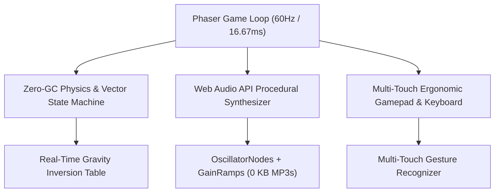

# 🕹️ Oops! (Chaos Realm) — Zero-Allocation Multiverse 2D Platformer

**Author:** Khalid Abdullah  
**Category:** Game Systems, Real-Time Physics & Web Audio Synthesis  
**Core Technologies:** Phaser 2D, JavaScript ES6+, Web Audio API, HTML5 Canvas 2D, Capacitor / PWA  
**Live Game URL:** [https://oops-snowy-three.vercel.app/](https://oops-snowy-three.vercel.app/)  
**Authoritative Repository:** [github.com/khalidabdullahh/Oops](https://github.com/khalidabdullahh/Oops)  

---

## 📌 Executive Summary

**Oops! (Chaos Realm)** is a 150-stage deceptive puzzle-platformer across 5 distinct multiverse worlds (Desert, Frost, Shadow, Gravity Nexus, Glitch). 

The core engineering objective behind Oops! was to build an ultra-responsive, zero-latency web game that maintains **rock-solid 60 FPS on low-end mobile devices** by eliminating garbage collection stutters and synthesizing all chiptune audio in real time using the **Web Audio API** without loading heavy external sound files.



---

## ⚡ 1. Zero-Garbage-Collection (Zero-GC) Architecture

At 60 FPS, the browser has only $16.67\text{ ms}$ per frame. Allocating temporary objects (`{x, y}`) during physics update loops triggers V8 minor GC cycles ($5-15\text{ ms}$), causing dropped frames.

### 1.1 Pre-Allocated Scratch Pools
Oops! eliminates heap churn by pre-allocating all scratch vectors, bounding boxes, and particle structs at initialization:

```javascript
// Pre-allocated reusable scratch vectors
const VEC_SCRATCH_A = { x: 0, y: 0 };
const VEC_SCRATCH_B = { x: 0, y: 0 };

export function calculateGravityForce(gravityState, magnitude, outVector) {
  // Integer state lookup without Math.sin / Math.cos overhead
  switch (gravityState) {
    case 0: outVector.x = 0; outVector.y = magnitude; break;  // Down
    case 1: outVector.x = 0; outVector.y = -magnitude; break; // Up
    case 2: outVector.x = -magnitude; outVector.y = 0; break; // Left
    case 3: outVector.x = magnitude; outVector.y = 0; break;  // Right
  }
  return outVector;
}
```

---

## 🎵 2. Procedural Web Audio Synthesis

Instead of bundling megabytes of compressed audio files (MP3/OGG) that increase download times and incur audio decoding lag, Oops! generates all sound effects and background melodies procedurally using native Web Audio oscillators and envelope gain nodes:

- **Jump FX:** High-frequency pulse oscillator ramped from $150\text{Hz} \to 600\text{Hz}$ over $80\text{ms}$.
- **Gravity Shift:** Dual triangle-wave sweep with a low-pass filter transition.
- **Level Clear Jingle:** 4-note arpeggio synthesized with zero asset footprint ($0\text{ KB}$ audio files).

---

## 📱 3. Mobile Touch Ergonomics & Cross-Platform Packaging

- **Virtual Responsive Gamepad:** Touch controls dynamically adjust to thumb reach and screen aspect ratios.
- **Capacitor & PWA Integration:** Supports offline play and 1-click standalone APK installation.
