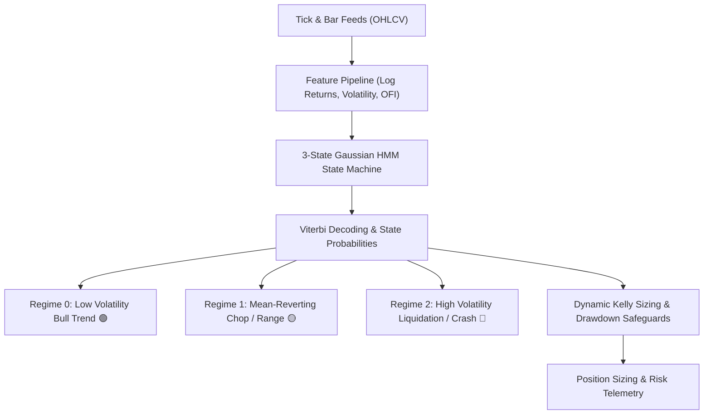

# 📈 Trading OS — Quantitative Market Regime & Volatility Intelligence Suite

**Author:** Khalid Abdullah  
**Category:** Quantitative Finance, Machine Learning & Stochastic Modeling  
**Core Technologies:** Python, Hidden Markov Models (Gaussian HMM), NumPy, Pandas, Scikit-Learn, Canvas 2D / WebGL, FastAPI  
**Authoritative Repository:** [github.com/khalidabdullahh/trading-os](https://github.com/khalidabdullahh)  

---

## 📌 Executive Summary

**Trading OS** is a quantitative research platform and real-time market simulator engineered to solve a fundamental problem in systematic trading: **market regime shifts**. 

Traditional technical indicators (moving averages, RSI) assume stationarity and suffer catastrophic drawdowns during transitions from trending to mean-reverting or high-volatility crash states. Trading OS utilizes unsupervised **Gaussian Hidden Markov Models (HMM)** and continuous **high-frequency volatility estimators** to segment asset dynamics in real time and optimize position sizing via the **Kelly Criterion**.

---

## 🔬 1. Mathematical Formulation & Statistical Engine

### 1.1 Gaussian Hidden Markov Model
Let $S_t \in \{0, 1, 2\}$ denote the unobserved market regime state at time $t$. The state transition follows a first-order Markov chain:
$$P(S_t = j \mid S_{t-1} = i) = A_{ij}$$

The emission probability of observed feature vector $\mathbf{Y}_t$ given state $S_t = j$ is modeled as a multivariate Gaussian distribution:
$$\mathbf{Y}_t \mid S_t = j \sim \mathcal{N}(\boldsymbol{\mu}_j, \boldsymbol{\Sigma}_j)$$

### 1.2 Multi-Feature Input Vector
Rather than relying solely on raw close-to-close returns, the feature matrix $\mathbf{Y}_t$ incorporates:
1. **Logarithmic Returns:** $r_t = \ln(P_t / P_{t-1})$
2. **Parkinson High-Low Realized Volatility:**
   $$\sigma_{\text{Parkinson}}^2 = \frac{(\ln(H_t / L_t))^2}{4 \ln 2}$$
3. **Garman-Klass Opening/Closing Drift Volatility:**
   $$\sigma_{\text{GK}}^2 = 0.5 \left( \ln \frac{H_t}{L_t} \right)^2 - (2\ln 2 - 1) \left( \ln \frac{C_t}{O_t} \right)^2$$
4. **Order Flow Imbalance (OFI Ratio):** Quantifying aggressive buyer vs. seller delta.

---

## 🎮 2. In-Browser Interactive Simulator

To provide instant intuition and test strategy robustness, Trading OS includes a zero-dependency **client-side Monte Carlo simulation engine**:
- **Drift ($\mu$) & Volatility ($\sigma$) Controls:** Real-time geometric Brownian motion parameter manipulation.
- **Jump-Shock Injection:** Simulating sudden liquidity cascades and black swan fat-tail distributions.
- **Color-Coded Canvas Trajectory:** Canvas 2D dynamically renders decoded states with high-performance zero-GC loops.

---

## ⚖️ 3. Position Sizing & Kelly Criterion Integration

Once the regime probability vector $\boldsymbol{\pi}_t = [P(S_t=0), P(S_t=1), P(S_t=2)]$ is estimated, capital allocation is adjusted dynamically:

$$f^* = \frac{p(b+1) - 1}{b}$$

- **Fractional Kelly Dampening:** During Regime 1 (Chop), bet sizing is dampened to $\frac{1}{4}\text{ Kelly}$ to avoid churn.
- **Circuit Breakers:** During Regime 2 (Crash/High Volatility), positions are automatically liquidated or hedged into defensive cash allocations.
