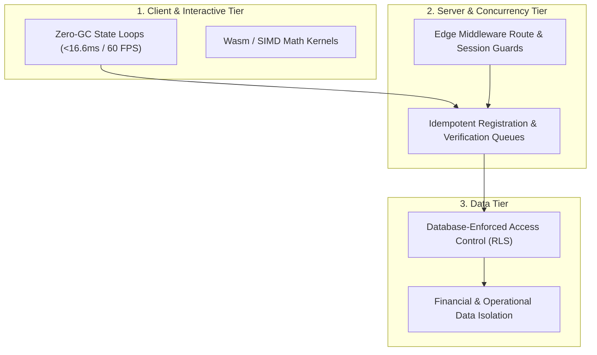

# 📐 System Design & Scalability Engineering Standards

This section outlines system design blueprints, high-concurrency architecture patterns, latency reduction techniques, and reliability case studies authored by **Khalid Abdullah**.

---

## 🏛️ System Design Taxonomy

---

## 📚 Case Studies & Design Notes

1. **Esports Platform System Design:**
   - [`system-design/system-design-case-studies/esports-tournament-platform.md`](./system-design-case-studies/esports-tournament-platform.md): End-to-end design for a multi-tenant competitive gaming engine handling concurrent registrations and time-gated lobby access.
2. **Zero-Garbage Collection State Machines:**
   - [`system-design/architecture-patterns/zero-gc-state-machines.md`](./architecture-patterns/zero-gc-state-machines.md): Memory pool management, scratch vectors, and zero-allocation frame loops in browser physics and canvas engines.
3. **High-Performance Real-Time Simulation:**
   - [`system-design/scalability/realtime-regime-simulation.md`](./scalability/realtime-regime-simulation.md): In-browser Monte Carlo stochastic path generation and HMM state decoding under strict memory bounds.
