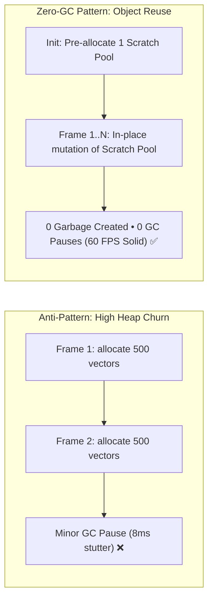

# ⚡ Architecture Pattern: Zero-Garbage-Collection (Zero-GC) State Loops

**Topic:** Eliminating Memory Churn in Real-Time 60 FPS Canvases & Simulation Engines  
**Reference Implementations:** Oops!, Trading OS Market Simulator, AlgoViz  
**Author:** Khalid Abdullah  

---

## 📌 The Engineering Problem

JavaScript engines use automatic garbage collection (GC). When an animation or simulation loop creates temporary objects (e.g. `{ x, y }`, arrays, intermediate mathematical matrices) at $60\text{Hz}$, the heap fills rapidly. 

When the V8 Young Generation space exhausts, the browser initiates a **Minor GC Stop-The-World pause** lasting $4-15\text{ms}$. This consumes the majority of the frame budget ($16.67\text{ms}$), causing dropped frames and visible stutter.



---

## 🛠️ 1. Implementation Blueprint

```javascript
// Pre-allocated Vector Pool
export class Vector2D {
  constructor(x = 0, y = 0) {
    this.x = x;
    this.y = y;
  }
  set(x, y) {
    this.x = x;
    this.y = y;
    return this;
  }
  add(v) {
    this.x += v.x;
    this.y += v.y;
    return this;
  }
}

// Global Static Scratch Pool
export const POOL = {
  v1: new Vector2D(),
  v2: new Vector2D(),
  v3: new Vector2D()
};

// Physics Step with ZERO dynamic allocations
export function updateParticle(particle, gravity, friction) {
  POOL.v1.set(gravity.x, gravity.y);
  particle.velocity.add(POOL.v1);
  particle.velocity.x *= friction;
  particle.velocity.y *= friction;
  particle.position.add(particle.velocity);
}
```
