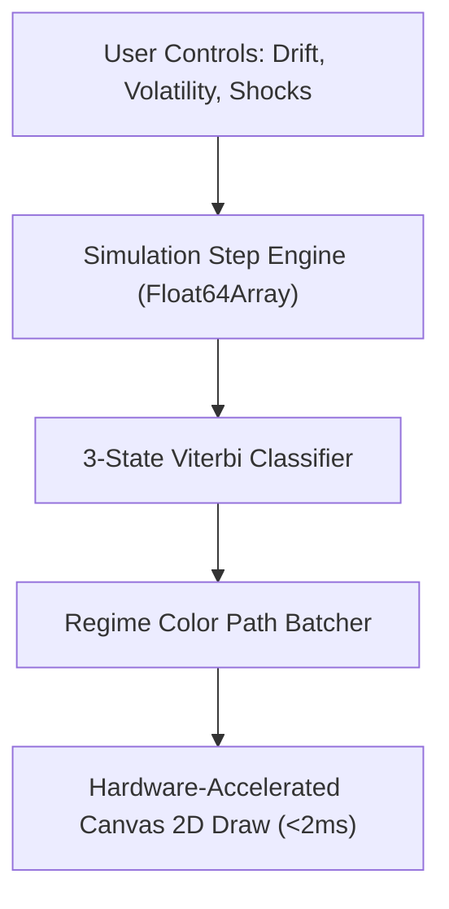

# 📈 Scalability & Performance: In-Browser Stochastic Simulation Engines

**Topic:** High-Frequency Monte Carlo & HMM State Decoding on Client Runtimes  
**Reference Implementations:** Trading OS Market Regime Simulator  
**Author:** Khalid Abdullah  

---

## 📌 Architectural Blueprint

Executing Monte Carlo simulations ($100-500\text{ bars}$) and Hidden Markov Model forward-filtering directly in client browser threads without freezing the DOM requires:
1. **Zero-Allocation Array Buffers:** Using `Float64Array` typed arrays for fast mathematical operations.
2. **Fixed-Step Numerical Integration:** Utilizing Euler-Maruyama discretization for Geometric Brownian Motion.
3. **Canvas 2D Path Batching:** Minimizing `ctx.stroke()` and `ctx.beginPath()` context switches by batching contiguous regime states into single path segments.

