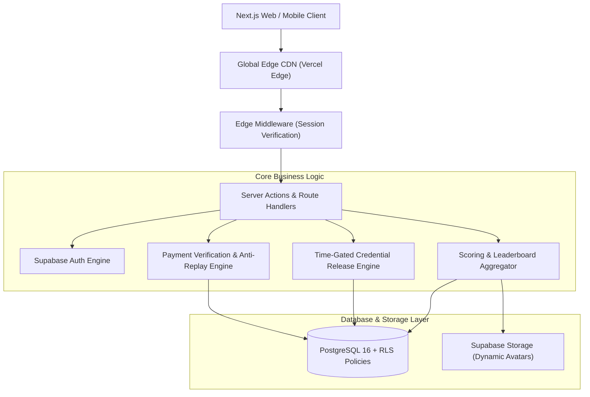
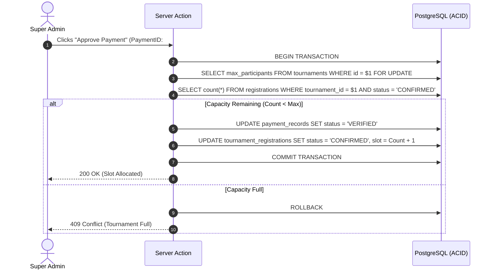

# 🏆 System Design Case Study: Multi-Tenant Esports Tournament Platform

**System Goal:** Design an esports tournament platform capable of handling $10,000+$ concurrent participants across multiple game titles, automated payment verification pipelines, time-gated credential distribution, and zero-leak leaderboards.  
**Reference Implementation:** ARENEX  
**Author:** Khalid Abdullah  

---

## 📌 1. Requirements & System Scale

### Functional Requirements:
1. **Multi-Game & Multi-Format:** Support for Solo, Duo, Squad modes across different mobile/PC titles (Free Fire, PUBG Mobile, Valorant).
2. **Multi-Tournament Enrolment:** Players must be able to enter multiple simultaneous or scheduled tournaments without account lockouts.
3. **Verified Payment Submission:** Players submit transaction proofs (TxID, MFS provider, phone) with anti-replay guarantees.
4. **Time-Gated Credential Access:** Room ID and password are only revealed to confirmed participants within a configurable pre-match window ($T - 15\text{ min}$).
5. **Dynamic Scoring & Real Avatars:** Standings reflect real player stats and avatars dynamically linked from profile storage.

### Non-Functional Requirements:
- **Low Latency:** Roster queries $<50\text{ms}$; room credential release $<10\text{ms}$.
- **Zero Financial Leakage:** Player views strictly isolated from organizer revenues.
- **ACID Slot Allocation:** No overbooking beyond `max_participants`.

---

## 🏛️ 2. High-Level Architecture Diagram

---

## 🔄 3. Critical Flow: Race-Condition Free Slot Allocation

